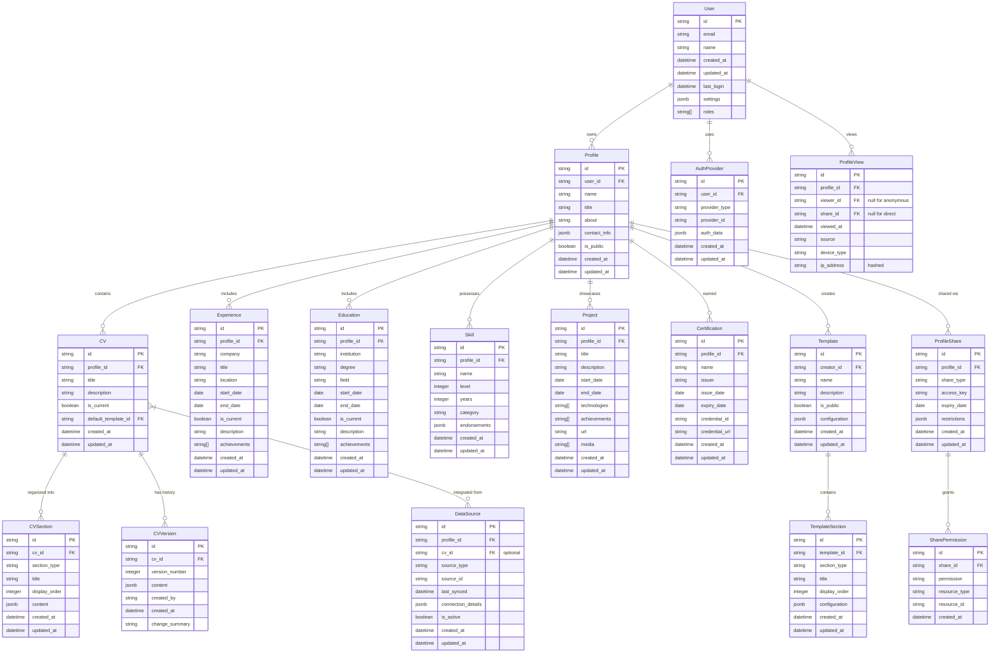

# API Contracts and Data Models

## Overview

This document defines the standardized API contracts and data models for the "Help Them Discover You" platform. These contracts serve as the foundational interfaces between system components, enabling parallel development while ensuring proper integration.

## Core Data Models

The following data models represent the essential entities within the platform. These models establish a shared understanding across all system components and serve as dependencies for implementation.

### Entity Relationship Diagram



## API Contracts

The following API contracts define the standard endpoints and operations for interacting with the system. These contracts serve as the foundation for the platform's service interfaces.

### Authentication API

#### Register User
```
POST /api/v1/auth/register

Request:
{
  "email": "string",
  "password": "string",
  "name": "string"
}

Response:
{
  "user": {
    "id": "string",
    "email": "string",
    "name": "string",
    "created_at": "datetime"
  },
  "token": "string"
}
```

#### Login User
```
POST /api/v1/auth/login

Request:
{
  "email": "string",
  "password": "string"
}

Response:
{
  "user": {
    "id": "string",
    "email": "string",
    "name": "string",
    "last_login": "datetime"
  },
  "token": "string"
}
```

#### OAuth Authentication
```
GET /api/v1/auth/{provider}/connect
GET /api/v1/auth/{provider}/callback

Response:
{
  "user": {
    "id": "string",
    "email": "string",
    "name": "string",
    "last_login": "datetime"
  },
  "token": "string",
  "profile_created": "boolean",
  "provider_data": {
    "provider": "string",
    "provider_id": "string"
  }
}
```

#### Get Current User
```
GET /api/v1/auth/me

Response:
{
  "user": {
    "id": "string",
    "email": "string",
    "name": "string",
    "created_at": "datetime",
    "updated_at": "datetime",
    "last_login": "datetime",
    "settings": {
      "email_notifications": "boolean",
      "language": "string",
      "theme": "string"
    },
    "roles": ["string"]
  }
}
```

#### Update User Settings
```
PATCH /api/v1/auth/settings

Request:
{
  "settings": {
    "email_notifications": "boolean",
    "language": "string",
    "theme": "string"
  }
}

Response:
{
  "user": {
    "id": "string",
    "settings": {
      "email_notifications": "boolean",
      "language": "string",
      "theme": "string"
    },
    "updated_at": "datetime"
  }
}
```

### Profile API

#### Create Profile
```
POST /api/v1/profiles

Request:
{
  "name": "string",
  "title": "string",
  "about": "string",
  "contact_info": {
    "email": "string",
    "phone": "string",
    "location": "string",
    "social": [
      {
        "platform": "string",
        "url": "string",
        "username": "string"
      }
    ]
  },
  "is_public": "boolean"
}

Response:
{
  "profile": {
    "id": "string",
    "user_id": "string",
    "name": "string",
    "title": "string",
    "about": "string",
    "contact_info": {},
    "is_public": "boolean",
    "created_at": "datetime",
    "updated_at": "datetime"
  }
}
```

#### Get Profile
```
GET /api/v1/profiles/{id}

Response:
{
  "profile": {
    "id": "string",
    "user_id": "string",
    "name": "string",
    "title": "string",
    "about": "string",
    "contact_info": {},
    "is_public": "boolean",
    "created_at": "datetime",
    "updated_at": "datetime",
    "experience": [],
    "education": [],
    "skills": [],
    "projects": [],
    "certifications": []
  }
}
```

#### Update Profile
```
PUT /api/v1/profiles/{id}

Request:
{
  "name": "string",
  "title": "string",
  "about": "string",
  "contact_info": {},
  "is_public": "boolean"
}

Response:
{
  "profile": {
    "id": "string",
    "user_id": "string",
    "name": "string",
    "title": "string",
    "about": "string",
    "contact_info": {},
    "is_public": "boolean",
    "updated_at": "datetime"
  }
}
```

#### Delete Profile
```
DELETE /api/v1/profiles/{id}

Response:
{
  "success": "boolean",
  "deleted_at": "datetime"
}
```

#### Add Experience
```
POST /api/v1/profiles/{id}/experience

Request:
{
  "company": "string",
  "title": "string",
  "location": "string",
  "start_date": "date",
  "end_date": "date",
  "is_current": "boolean",
  "description": "string",
  "achievements": ["string"]
}

Response:
{
  "experience": {
    "id": "string",
    "profile_id": "string",
    "company": "string",
    "title": "string",
    "location": "string",
    "start_date": "date",
    "end_date": "date",
    "is_current": "boolean",
    "description": "string",
    "achievements": ["string"],
    "created_at": "datetime",
    "updated_at": "datetime"
  }
}
```

#### Similar endpoints for Education, Skills, Projects, Certifications
```
POST /api/v1/profiles/{id}/education
POST /api/v1/profiles/{id}/skills
POST /api/v1/profiles/{id}/projects
POST /api/v1/profiles/{id}/certifications
```

### CV API

#### Upload CV
```
POST /api/v1/cvs/upload

Request:
{
  "profile_id": "string",
  "title": "string",
  "description": "string",
  "file": "binary"
}

Response:
{
  "cv": {
    "id": "string",
    "profile_id": "string",
    "title": "string",
    "description": "string",
    "original_filename": "string",
    "file_type": "string",
    "file_size": "number",
    "processing_status": "string",
    "created_at": "datetime"
  },
  "job_id": "string"
}
```

#### Get CV Processing Status
```
GET /api/v1/cvs/{id}/status

Response:
{
  "cv": {
    "id": "string",
    "processing_status": "string",
    "processing_progress": "number",
    "processing_message": "string",
    "last_updated": "datetime"
  }
}
```

#### Get CV
```
GET /api/v1/cvs/{id}

Response:
{
  "cv": {
    "id": "string",
    "profile_id": "string",
    "title": "string",
    "description": "string",
    "is_current": "boolean",
    "created_at": "datetime",
    "updated_at": "datetime",
    "sections": [
      {
        "id": "string",
        "section_type": "string",
        "title": "string",
        "display_order": "number",
        "content": {}
      }
    ]
  }
}
```

#### Get CV Versions
```
GET /api/v1/cvs/{id}/versions

Response:
{
  "versions": [
    {
      "id": "string",
      "cv_id": "string",
      "version_number": "number",
      "created_by": "string",
      "created_at": "datetime",
      "change_summary": "string"
    }
  ]
}
```

#### Get CV Version Content
```
GET /api/v1/cvs/{id}/versions/{version_number}

Response:
{
  "version": {
    "id": "string",
    "cv_id": "string",
    "version_number": "number",
    "content": {},
    "created_by": "string",
    "created_at": "datetime",
    "change_summary": "string"
  }
}
```

### Template API

#### Create Template
```
POST /api/v1/templates

Request:
{
  "name": "string",
  "description": "string",
  "is_public": "boolean",
  "configuration": {}
}

Response:
{
  "template": {
    "id": "string",
    "creator_id": "string",
    "name": "string",
    "description": "string",
    "is_public": "boolean",
    "configuration": {},
    "created_at": "datetime",
    "updated_at": "datetime"
  }
}
```

#### Get Templates
```
GET /api/v1/templates?public=true&limit=10&offset=0

Response:
{
  "templates": [
    {
      "id": "string",
      "creator_id": "string",
      "name": "string",
      "description": "string",
      "is_public": "boolean",
      "created_at": "datetime",
      "updated_at": "datetime"
    }
  ],
  "pagination": {
    "total": "number",
    "limit": "number",
    "offset": "number",
    "has_more": "boolean"
  }
}
```

#### Apply Template to CV
```
POST /api/v1/cvs/{id}/apply-template

Request:
{
  "template_id": "string",
  "customizations": {}
}

Response:
{
  "rendered_cv": {
    "id": "string",
    "profile_id": "string",
    "title": "string",
    "description": "string",
    "template_id": "string",
    "customizations": {},
    "rendered_content": {},
    "created_at": "datetime"
  }
}
```

### Sharing API

#### Create Share Link
```
POST /api/v1/profiles/{id}/share

Request:
{
  "share_type": "string", // "link", "email", "specific_user"
  "expiry_date": "date",
  "permissions": [
    {
      "permission": "string", // "view", "comment", "edit"
      "resource_type": "string", // "profile", "cv", "section"
      "resource_id": "string" // optional, if specific resource
    }
  ],
  "restrictions": {
    "view_limit": "number",
    "password_required": "boolean",
    "password": "string" // if password_required is true
  }
}

Response:
{
  "share": {
    "id": "string",
    "profile_id": "string",
    "share_type": "string",
    "access_key": "string",
    "share_url": "string",
    "expiry_date": "date",
    "restrictions": {},
    "created_at": "datetime",
    "permissions": []
  }
}
```

#### Get Share Information
```
GET /api/v1/shares/{access_key}

Response:
{
  "share": {
    "id": "string",
    "profile_id": "string",
    "share_type": "string",
    "access_key": "string",
    "expiry_date": "date",
    "restrictions": {},
    "created_at": "datetime",
    "permissions": [],
    "profile": {
      "name": "string",
      "title": "string"
    },
    "views": {
      "total": "number",
      "last_viewed": "datetime"
    }
  }
}
```

#### Access Shared Profile
```
GET /api/v1/shares/{access_key}/access

Request:
{
  "password": "string" // if required
}

Response:
{
  "access_granted": "boolean",
  "profile": {
    // Filtered profile data based on permissions
  },
  "permissions": []
}
```

### Data Integration API

#### Connect Data Source
```
POST /api/v1/integrations/connect

Request:
{
  "profile_id": "string",
  "source_type": "string", // "linkedin", "github", etc.
  "connection_details": {}
}

Response:
{
  "integration": {
    "id": "string",
    "profile_id": "string",
    "source_type": "string",
    "auth_url": "string", // for OAuth flows
    "created_at": "datetime"
  }
}
```

#### Get Data Source Status
```
GET /api/v1/integrations/{id}/status

Response:
{
  "integration": {
    "id": "string",
    "profile_id": "string",
    "source_type": "string",
    "source_id": "string",
    "is_active": "boolean",
    "last_synced": "datetime",
    "status": "string",
    "status_message": "string"
  }
}
```

#### Sync Data from Source
```
POST /api/v1/integrations/{id}/sync

Response:
{
  "job": {
    "id": "string",
    "integration_id": "string",
    "status": "string",
    "created_at": "datetime"
  }
}
```

### Analytics API

#### Get Profile Insights
```
GET /api/v1/profiles/{id}/insights

Response:
{
  "insights": {
    "skill_distribution": {
      "categories": ["string"],
      "values": ["number"]
    },
    "experience_timeline": [
      {
        "period": "string",
        "role": "string",
        "company": "string",
        "duration": "number"
      }
    ],
    "skill_gaps": [
      {
        "skill": "string",
        "market_importance": "number",
        "current_level": "number"
      }
    ],
    "profile_completene
(Content truncated due to size limit. Use line ranges to read in chunks)