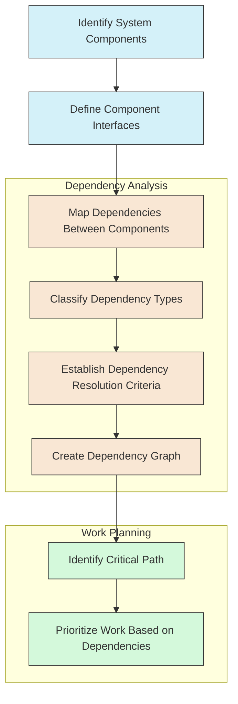
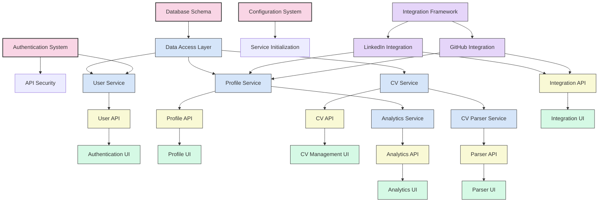
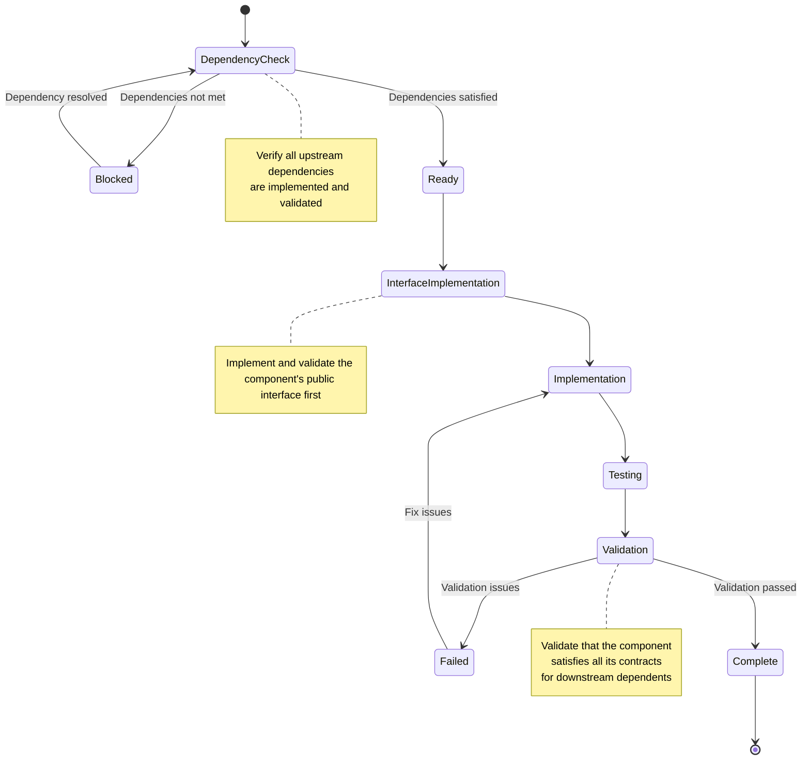
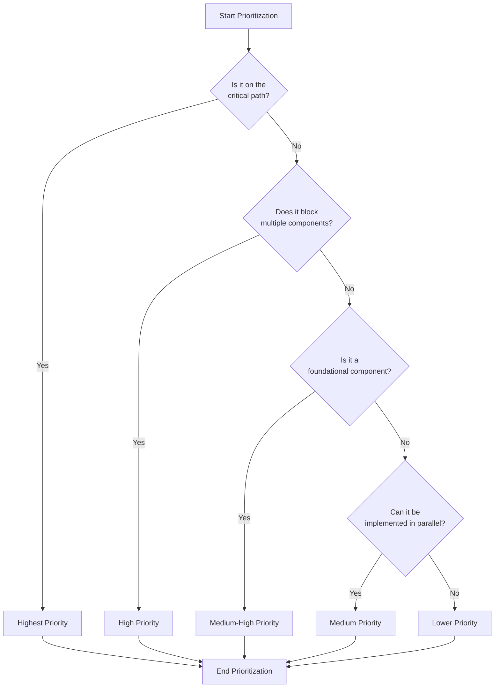
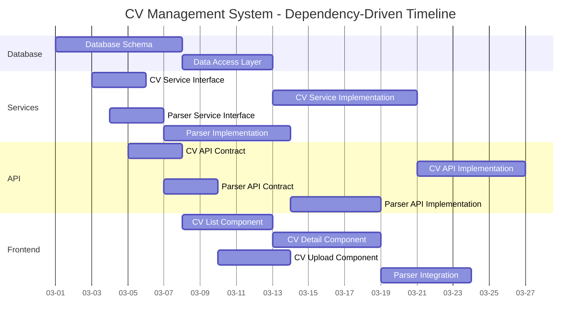

# Dependency-Driven Implementation Framework

## Overview

This document establishes a comprehensive framework for dependency-driven technical implementation, prioritizing the resolution of technical prerequisites and architectural constraints over time-based planning. This approach ensures that development progresses in a logically sound sequence, with each component building upon properly completed dependencies.

## Core Principles

### 1. Dependency Resolution Over Time-Based Milestones

Traditional project management often emphasizes calendar-based milestones, which can lead to artificial deadlines disconnected from technical realities. Instead, this framework prioritizes:

- Proper sequencing of technical dependencies
- Unblocking critical path components
- Quality-focused implementation
- Architectural integrity

### 2. Clear Upstream/Downstream Relationships

All components must have explicitly defined:

- Upstream dependencies (prerequisites required before work can begin)
- Downstream dependents (components that rely on this component)
- Interface contracts between components
- Validation criteria for dependency satisfaction

### 3. Parallel Development Where Possible

While respecting dependencies, the framework maximizes parallel development through:

- Interface-first development
- Mock implementations
- Clear contract definitions
- Encapsulated components with well-defined boundaries

### 4. Continuous Integration and Validation

To ensure components work together as dependencies are resolved:

- Automated testing of interface contracts
- Continuous integration of completed components
- Regular system-wide integration testing
- Dependency validation protocols

## Dependency Mapping Process

## Dependency Classification

### Hard Dependencies (Blocking)

Components that must be completed before dependent work can begin:

- Database schema before data access layer
- Authentication framework before secure endpoints
- Core data models before dependent services
- API contracts before implementation

### Soft Dependencies (Non-Blocking with Workarounds)

Components that would ideally be completed first, but can be worked around temporarily:

- Backend services (can use mock implementations)
- External integrations (can use simulated responses)
- UI components (can use placeholder content)
- Advanced features (can implement basic versions first)

### Interface Dependencies

Components that require defined interfaces but not complete implementations:

- API endpoints (need contract definitions)
- Component props (need interface definitions)
- Events and messages (need schema definitions)
- Database access (need query interface definitions)

## Dependency Graph Visualization

## Dependency Resolution Workflow

### 1. Component Development Lifecycle

### 2. Decision Process for Dependency Prioritization

### 3. Dependency Resolution Strategies

For each dependency type, different resolution strategies apply:

#### Hard Dependencies

- **Strategy**: Prioritize implementation of upstream components
- **Tracking**: Maintain explicit status of all hard dependencies
- **Resolution**: Complete implementation and validation before dependent work

#### Soft Dependencies

- **Strategy**: Implement mock interfaces or simulations
- **Tracking**: Document temporary implementations and technical debt
- **Resolution**: Replace mocks with real implementations as dependencies are resolved

#### Interface Dependencies

- **Strategy**: Define and freeze interface contracts early
- **Tracking**: Version-control interface definitions
- **Resolution**: Validate implementations against interface contracts

## Implementation Process

### 1. Initial Dependency Analysis

1. Identify all system components
2. Define component interfaces and contracts
3. Map dependencies between components
4. Classify dependencies by type and impact
5. Create comprehensive dependency graph

### 2. Work Prioritization

1. Identify the critical path based on dependency chains
2. Prioritize blocking dependencies that impact multiple components
3. Group components that can be developed in parallel
4. Allocate resources based on dependency priorities

### 3. Implementation Sequence

1. Begin with foundational components (database, authentication, core services)
2. Implement and validate interfaces early
3. Develop and integrate components as dependencies are resolved
4. Continuous validation of dependency satisfaction

### 4. Integration and Validation

1. Validate components against their interface contracts
2. Integrate completed components continuously
3. Run cross-component tests for dependency validation
4. Systematic verification of dependency chains

## Tools and Techniques

### 1. Dependency Visualization

- **Dependency Graphs**: Visual representation of component relationships
- **Critical Path Analysis**: Identifying sequential dependency chains
- **Impact Analysis**: Assessing the downstream impact of changes

### 2. Interface-First Development

- **Contract Definitions**: Formal specification of component interfaces
- **Mock Implementations**: Temporary implementations of dependencies
- **Contract Testing**: Validation of implementations against contracts

### 3. Continuous Integration

- **Automated Interface Testing**: Validating implementations against contracts
- **Integration Testing**: Verifying component interactions
- **Dependency Validation**: Confirming that dependencies are properly resolved

### 4. Progress Tracking

- **Dependency Status Dashboard**: Visual tracking of dependency resolution
- **Blocker Identification**: Early visibility of blocking dependencies
- **Dependency-Based Progress**: Measuring progress by dependency resolution

## Risk Management

### 1. Dependency-Related Risks

| Risk | Impact | Mitigation |
|------|--------|------------|
| Unidentified dependencies | Unexpected blocking | Comprehensive initial analysis, regular review |
| Interface changes | Breaking downstream dependents | Strong interface contracts, versioning |
| Delayed critical path items | Project stagnation | Prioritization framework, resource flexibility |
| Integration failures | Component incompatibility | Continuous integration, contract testing |
| Complex dependency chains | Limited parallelization | Refactor to reduce tight coupling |

### 2. Mitigation Strategies

- **Regular Dependency Reviews**: Periodic assessment of dependency accuracy
- **Interface Stability Policy**: Controls for interface changes
- **Critical Path Monitoring**: Close tracking of critical dependencies
- **Flexible Resource Allocation**: Ability to shift resources to blocking items
- **Architectural Refactoring**: Breaking complex dependencies when needed

## Dependency-Driven Planning Example

### Feature: CV Management System

Note that this Gantt chart shows a dependency-driven sequence, but the focus is on dependencies (shown with "after" relationships) rather than specific calendar dates. The dates are illustrative only - actual implementation would proceed based on dependency resolution, not calendar targets.

## Conclusion

This dependency-driven implementation framework provides a structured approach to software development that emphasizes proper sequence, architectural integrity, and technical quality over arbitrary deadlines. By explicitly mapping and resolving dependencies, we can achieve more predictable outcomes and avoid the issues that arise from forcing development to meet calendar-based targets that may not align with technical realities.

The framework supports autonomous decision-making within architectural boundaries by providing clear guidelines for dependency identification, classification, and resolution. It enables teams to make informed decisions about implementation sequence and resource allocation based on objective technical dependencies rather than subjective priorities.

By focusing on dependency resolution as the primary driver of progress, we can build a robust, maintainable system with a solid architectural foundation.