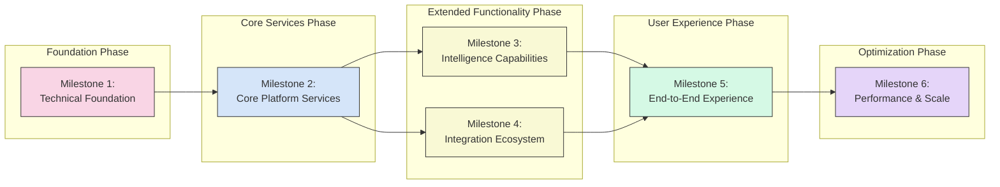
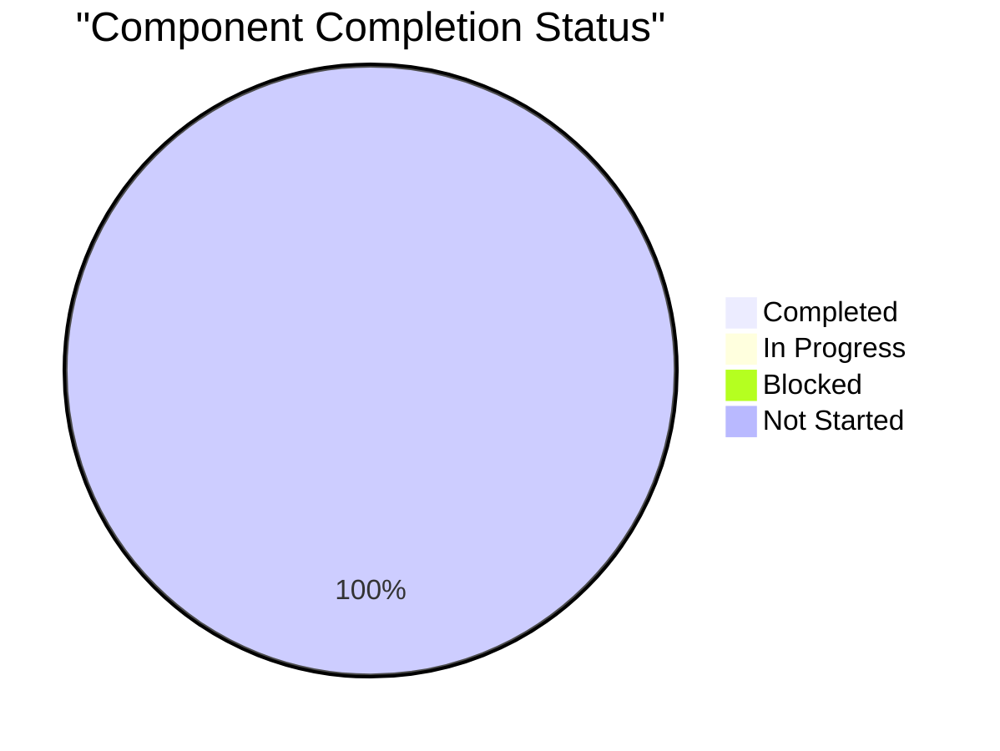
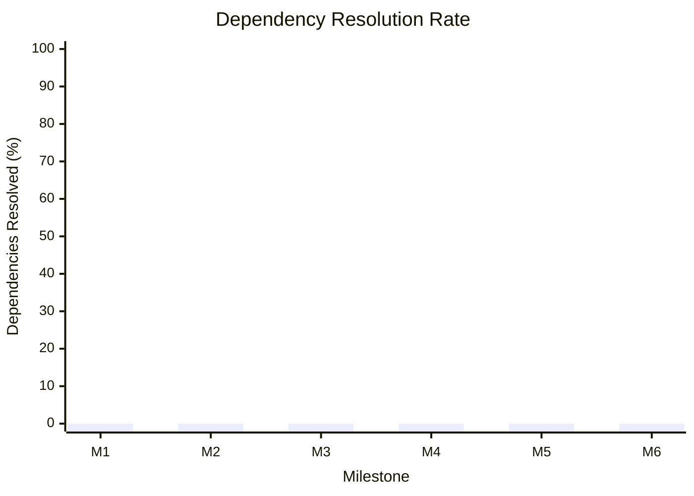
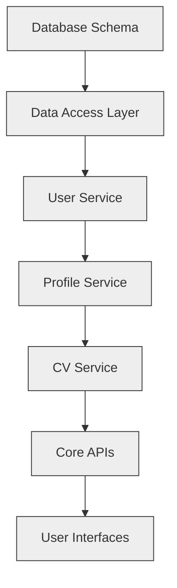
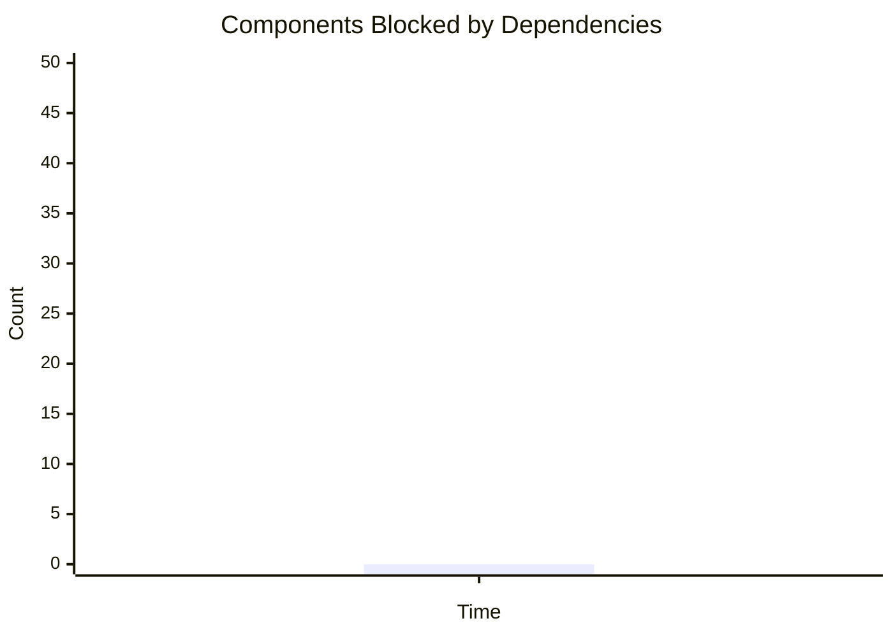
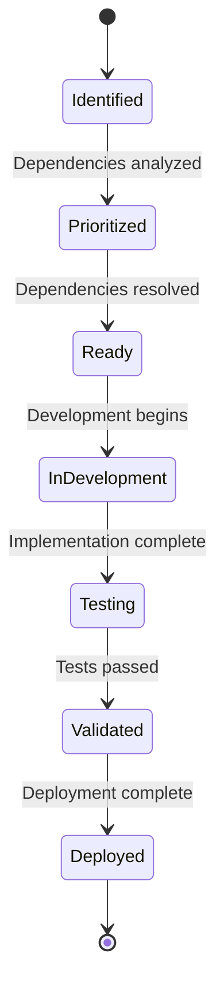

# Dependency-Driven Implementation Roadmap

## Overview

This roadmap provides a strategic overview of the "Help Them Discover You" platform implementation journey. Unlike traditional roadmaps that use fixed calendar dates, this approach focuses on dependency resolution and technical milestones. Progress is measured by component completion and dependency satisfaction rather than adherence to arbitrary deadlines.

## Roadmap Visualization

The following visualization shows the progression through major implementation milestones, driven by dependency resolution:

## Milestones and Dependency Gates

Each milestone represents a significant achievement in the platform's evolution, with explicitly defined dependency requirements that must be satisfied before proceeding.

### Milestone 1: Technical Foundation

**Dependency Gate:** No prerequisites (starting point)

**Key Components:**
- Database schema and data models implemented
- Authentication system operational
- API gateway and routing established
- Storage infrastructure configured
- Core DevOps pipeline established

**Acceptance Criteria:**
- ✅ Database schema can support all core entities
- ✅ Authentication system passes security review
- ✅ API gateway handles routing and authentication
- ✅ Storage operations meet performance benchmarks
- ✅ Continuous integration pipeline operational

### Milestone 2: Core Platform Services

**Dependency Gate:** Milestone 1 completed

**Key Components:**
- User service fully implemented
- Profile service operational
- CV service with basic functionality
- Template service for CV formatting
- Sharing service for basic collaboration

**Acceptance Criteria:**
- ✅ User management functions operational
- ✅ Profile CRUD operations validated
- ✅ CV storage and retrieval functional
- ✅ Template application working
- ✅ Basic sharing capabilities operational
- ✅ Services pass integration tests

### Milestone 3: Intelligence Capabilities

**Dependency Gate:** Milestone 2 completed

**Key Components:**
- CV parsing intelligence
- Analytics processing pipelines
- Recommendation engine
- Machine learning foundation

**Acceptance Criteria:**
- ✅ CV parser extracts structured data with acceptable accuracy
- ✅ Analytics calculations perform within SLA
- ✅ Recommendations generate relevant results
- ✅ Machine learning foundation meets quality benchmarks

### Milestone 4: Integration Ecosystem

**Dependency Gate:** Milestone 2 completed

**Key Components:**
- Data source integrations (LinkedIn, GitHub, etc.)
- OAuth provider implementations
- External API connections
- Data synchronization mechanisms

**Acceptance Criteria:**
- ✅ All planned integrations functional
- ✅ OAuth flows secure and reliable
- ✅ External APIs connected and tested
- ✅ Data synchronization operates correctly

### Milestone 5: End-to-End Experience

**Dependency Gate:** Milestones 3 and 4 completed

**Key Components:**
- Complete user interfaces
- End-to-end user flows
- Cross-platform compatibility
- Usability optimization

**Acceptance Criteria:**
- ✅ All user interfaces implemented
- ✅ User flows validated through testing
- ✅ Cross-platform compatibility verified
- ✅ Usability testing completed with positive results

### Milestone 6: Performance & Scale

**Dependency Gate:** Milestone 5 completed

**Key Components:**
- Performance optimization
- Scalability testing
- Security hardening
- Operational readiness

**Acceptance Criteria:**
- ✅ Performance meets or exceeds targets
- ✅ System scales under load
- ✅ Security audit passed
- ✅ Operations procedures validated

## Progress Tracking

Progress will be tracked using the following dependency-based metrics instead of time-based targets:

### 1. Component Completion Status

### 2. Dependency Resolution Rate

### 3. Critical Path Progress

Critical path components will be monitored closely as they represent the minimal sequence of dependencies that must be resolved to reach completion.

### 4. Dependency Blocking Analysis

This tracks components blocked by unresolved dependencies:

## Implementation Streams

Multiple work streams will progress in parallel while respecting dependencies. The following streams will operate concurrently:

1. **Core Platform Stream**
   - Focus: Foundation and core services
   - Critical path: Yes

2. **Intelligence Stream**
   - Focus: CV parsing, analytics, recommendations
   - Dependencies: Core Services
   - Critical path: No

3. **Integration Stream**
   - Focus: External system connections
   - Dependencies: Core Services
   - Critical path: No

4. **Frontend Stream**
   - Focus: User interfaces and interactions
   - Dependencies: APIs from other streams
   - Critical path: Yes (final integration)

5. **DevOps Stream**
   - Focus: Infrastructure, CI/CD, observability
   - Dependencies: Minimal, mostly independent
   - Critical path: No

## Continuous Evolution 

The dependency-driven roadmap embraces continuous evolution rather than fixed releases:

### Feature Readiness Model

Features will be deployed when their dependencies are resolved and quality criteria are met, not according to predetermined release dates.

### Progressive Enhancement

The platform will follow a progressive enhancement approach, with each component adding value as it becomes available:

1. **Foundation First**: Core functionality before advanced features
2. **Incremental Intelligence**: Basic features before advanced ML capabilities
3. **Integration Layers**: Core integrations before specialized connectors
4. **UX Refinement**: Functional interfaces before advanced interactions

## Success Criteria

The implementation will be considered successful when:

1. All critical path dependencies have been resolved
2. Each milestone's acceptance criteria have been met
3. The platform delivers value to users at each stage of evolution
4. Technical quality meets or exceeds established standards
5. The architecture supports future growth and enhancement

## Conclusion

This dependency-driven roadmap provides a strategic framework for implementing the "Help Them Discover You" platform. By focusing on dependency resolution rather than calendar-based milestones, the roadmap enables a more flexible and realistic approach to development while ensuring that technical prerequisites are properly addressed.

The implementation will proceed through clearly defined milestones, with progress tracked based on completed components and satisfied dependencies. This approach allows for parallel development streams while maintaining the integrity of the overall architecture.