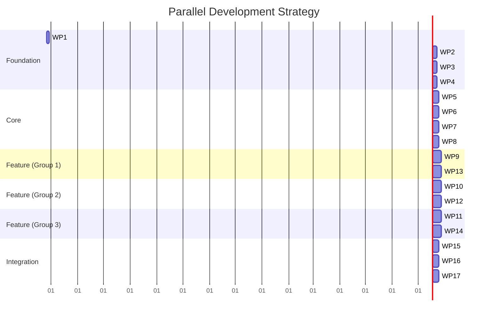

# Dependency-Based Work Package Structure

## Overview

This document restructures the implementation approach for our innovative personal marketing platform to enable parallel development by multiple LLMs. Instead of a time-based roadmap, we've created a dependency-based work package structure that identifies isolated components that can be developed independently once the core foundation is established.

The platform will be built using VSCode for development, GitHub for version control, Supabase for backend services, and Cloudflare for deployment and edge computing. This structure allows specialist LLMs to work on specific modules while maintaining clear integration points.

## Core Principles

1. **Dependency Isolation**: Each work package clearly defines its dependencies and what it provides to other packages
2. **Interface-First Design**: All modules communicate through well-defined interfaces
3. **Parallel Development**: Multiple LLMs can work simultaneously on different packages
4. **Progressive Enhancement**: The system works with minimal functionality and improves as more modules are completed
5. **Continuous Integration**: Automated testing ensures modules work together as they're developed

## Dependency Graph

The following diagram illustrates the dependencies between work packages, helping to identify which packages can be developed in parallel:

```mermaid
graph TD
    classDef foundation fill:#f9d5e5, stroke:#333, stroke-width:2px
    classDef core fill:#d5f9e5, stroke:#333, stroke-width:2px
    classDef feature fill:#d5e5f9, stroke:#333, stroke-width:1px
    classDef integration fill:#f9e5d5, stroke:#333, stroke-width:1px

    %% Foundation packages
    F1[WP1: Project Setup] :::foundation
    F2[WP2: Core Infrastructure] :::foundation
    F3[WP3: Authentication System] :::foundation
    F4[WP4: Database Schema] :::foundation
    
    %% Core packages
    C1[WP5: API Framework] :::core
    C2[WP6: Profile Management] :::core
    C3[WP7: Blockchain Connector] :::core
    C4[WP8: UI Component Library] :::core
    
    %% Feature packages
    P1[WP9: Persona Trait System] :::feature
    P2[WP10: Output Format Generator] :::feature
    P3[WP11: Content Distribution] :::feature
    P4[WP12: Career Interview System] :::feature
    P5[WP13: Verification System] :::feature
    P6[WP14: Analytics Engine] :::feature
    
    %% Integration packages
    I1[WP15: NOMORECV Integration] :::integration
    I2[WP16: External API Connectors] :::integration
    I3[WP17: Deployment Pipeline] :::integration
    
    %% Dependencies
    F1 --> F2
    F1 --> F3
    F1 --> F4
    
    F2 --> C1
    F3 --> C1
    F4 --> C1
    
    F4 --> C2
    C1 --> C2
    
    F4 --> C3
    C1 --> C3
    
    F2 --> C4
    
    C2 --> P1
    C1 --> P1
    
    C2 --> P2
    P1 --> P2
    C4 --> P2
    
    C1 --> P3
    P2 --> P3
    
    C2 --> P4
    P1 --> P4
    C4 --> P4
    
    C3 --> P5
    C2 --> P5
    
    P3 --> P6
    P2 --> P6
    
    C2 --> I1
    P2 --> I1
    
    C1 --> I2
    P3 --> I2
    
    F2 --> I3
    C1 --> I3
    
    %% Legend
    L1[Foundation Packages] :::foundation
    L2[Core Packages] :::core
    L3[Feature Packages] :::feature
    L4[Integration Packages] :::integration
```

## Work Package Definitions

### Foundation Packages

#### WP1: Project Setup
- **Description**: Initialize project repository, configure development environment, and set up CI/CD pipeline
- **Deliverables**:
  - GitHub repository with branch protection
  - VSCode configuration
  - ESLint and Prettier setup
  - Jest testing framework
  - GitHub Actions workflows
  - Documentation structure
- **Dependencies**: None
- **Provides**: Development environment for all other packages

#### WP2: Core Infrastructure
- **Description**: Set up cloud infrastructure and deployment configuration
- **Deliverables**:
  - Supabase project configuration
  - Cloudflare project setup
  - Storage configuration
  - Environment variable management
  - Local development environment
- **Dependencies**: WP1
- **Provides**: Infrastructure services for all other packages

#### WP3: Authentication System
- **Description**: Implement user authentication and authorization
- **Deliverables**:
  - User registration and login
  - OAuth integration
  - Role-based access control
  - Session management
  - Password reset functionality
- **Dependencies**: WP1
- **Provides**: Authentication services for all other packages

#### WP4: Database Schema
- **Description**: Design and implement database schema for all platform components
- **Deliverables**:
  - User and profile tables
  - Credential and verification tables
  - Trait and assessment tables
  - Content and distribution tables
  - Migration scripts
- **Dependencies**: WP1
- **Provides**: Data storage for all other packages

### Core Packages

#### WP5: API Framework
- **Description**: Create RESTful API framework with documentation
- **Deliverables**:
  - API router and middleware
  - Request validation
  - Response formatting
  - Error handling
  - API documentation
  - Rate limiting
- **Dependencies**: WP2, WP3, WP4
- **Provides**: API services for feature packages

#### WP6: Profile Management
- **Description**: Implement profile creation, management, and visualization
- **Deliverables**:
  - Profile CRUD operations
  - Experience and education management
  - Skills and certifications tracking
  - Project and achievement documentation
  - Basic profile visualization
- **Dependencies**: WP4, WP5
- **Provides**: Profile services for feature packages

#### WP7: Blockchain Connector
- **Description**: Create blockchain integration for credential verification
- **Deliverables**:
  - Blockchain connector (Sui, Solana, or Cardano)
  - Transaction management
  - Smart contract interfaces
  - Verification request handling
  - Gas fee optimization
- **Dependencies**: WP4, WP5
- **Provides**: Blockchain services for verification system

#### WP8: UI Component Library
- **Description**: Develop reusable UI components for all platform interfaces
- **Deliverables**:
  - Design system implementation
  - Form components
  - Data visualization components
  - Layout components
  - Interactive elements
  - Responsive design utilities
- **Dependencies**: WP2
- **Provides**: UI components for feature packages

### Feature Packages

#### WP9: Persona Trait System
- **Description**: Implement trait assessment, visualization, and recommendations
- **Deliverables**:
  - Trait assessment engine
  - Trait visualization components
  - Trait-based recommendations
  - Trait evolution tracking
- **Dependencies**: WP5, WP6
- **Provides**: Trait services for output and interview systems

#### WP10: Output Format Generator
- **Description**: Create multi-perspective view generator and visualization engine
- **Deliverables**:
  - Multi-perspective view generator
  - Interactive visualization engine
  - Narrative format generator
  - Export and integration system
- **Dependencies**: WP6, WP8, WP9
- **Provides**: Output formats for content distribution

#### WP11: Content Distribution
- **Description**: Implement content management and distribution across channels
- **Deliverables**:
  - Content manager
  - Distribution engine
  - Channel adapters
  - Distribution analytics
- **Dependencies**: WP5, WP10
- **Provides**: Distribution services for analytics and external integrations

#### WP12: Career Interview System
- **Description**: Create video/audio interview system with intelligent questions
- **Deliverables**:
  - Intelligent question generation
  - Video/audio interview capture
  - Real-time guidance system
  - Interview content extraction
- **Dependencies**: WP6, WP8, WP9
- **Provides**: Interview content for output formats

#### WP13: Verification System
- **Description**: Implement credential verification with zero-knowledge proofs
- **Deliverables**:
  - Credential verification system
  - Zero-knowledge proof implementation
  - Verification display components
  - Verification status tracking
- **Dependencies**: WP6, WP7
- **Provides**: Verification services for output formats

#### WP14: Analytics Engine
- **Description**: Create analytics for tracking engagement and optimizing content
- **Deliverables**:
  - Engagement tracking
  - Channel performance analysis
  - Content performance metrics
  - Optimization recommendations
- **Dependencies**: WP10, WP11
- **Provides**: Analytics services for platform optimization

### Integration Packages

#### WP15: NOMORECV Integration
- **Description**: Implement integration with existing NOMORECV platform
- **Deliverables**:
  - Data integration framework
  - Synchronization mechanisms
  - Complementary workflows
  - Unified user experience
- **Dependencies**: WP6, WP10
- **Provides**: NOMORECV integration services

#### WP16: External API Connectors
- **Description**: Create connectors for external platforms and services
- **Deliverables**:
  - Professional network connectors
  - Job platform connectors
  - Social media connectors
  - Email marketing connectors
- **Dependencies**: WP5, WP11
- **Provides**: External connectivity services

#### WP17: Deployment Pipeline
- **Description**: Set up production deployment and scaling infrastructure
- **Deliverables**:
  - Production environment configuration
  - Deployment automation
  - Monitoring and alerting
  - Performance optimization
  - Scaling configuration
- **Dependencies**: WP2, WP5
- **Provides**: Production deployment services

## Parallel Development Strategy

The work packages are designed to enable parallel development by multiple LLMs once the foundation packages are completed. The following diagram illustrates which packages can be developed simultaneously:



### Development Phases

1. **Foundation Phase**: WP1-WP4 must be completed first to provide the foundation for all other packages
2. **Core Phase**: WP5-WP8 build on the foundation and provide core services for feature packages
3. **Feature Phase 1**: WP9 and WP13 can be developed in parallel once their dependencies are met
4. **Feature Phase 2**: WP10 and WP12 can be developed in parallel once their dependencies are met
5. **Feature Phase 3**: WP11 and WP14 can be developed in parallel once their dependencies are met
6. **Integration Phase**: WP15-WP17 can be developed in parallel once their dependencies are met

## LLM Specialization

Different LLMs can specialize in different aspects of development based on their strengths:

### LLM-1: Foundation Specialist
- **Focus**: WP1, WP2, WP3, WP4
- **Skills**: Project setup, infrastructure, authentication, database design

### LLM-2: API and Backend Specialist
- **Focus**: WP5, WP6, WP7
- **Skills**: API development, profile management, blockchain integration

### LLM-3: UI and Visualization Specialist
- **Focus**: WP8, WP10, WP12
- **Skills**: UI components, visualization, interview interface

### LLM-4: Feature Specialist
- **Focus**: WP9, WP11, WP13, WP14
- **Skills**: Trait system, content distribution, verification, analytics

### LLM-5: Integration Specialist
- **Focus**: WP15, WP16, WP17
- **Skills**: NOMORECV integration, external APIs, deployment

## Work Package Handoff Process

To ensure smooth transitions between LLMs working on different packages, we'll implement the following handoff process:

1. **Package Documentation**: Each package includes comprehensive documentation:
   - Purpose and scope
   - API interfaces
   - Data models
   - Implementation details
   - Test cases
   - Integration points

2. **Interface Contracts**: Clear contracts define how packages interact:
   - Input/output specifications
   - Error handling
   - Performance requirements
   - Security considerations

3. **Acceptance Criteria**: Each package has defined acceptance criteria:
   - Functional requirements
   - Performance benchmarks
   - Security standards
   - Code quality metrics
   - Test coverage requirements

4. **Handoff Checklist**:
   - Documentation complete
   - Tests passing
   - Code reviewed
   - Integration tested
   - Performance verified
   - Security validated

## Conclusion

This dependency-based work package structure enables efficient parallel development by multiple LLMs while ensuring that the platform components integrate seamlessly. By clearly defining dependencies and interfaces, we can maximize development parallelism while minimizing integration challenges.

The foundation packages (WP1-WP4) will be implemented first to provide the core infrastructure for all other packages. Once these are complete, multiple LLMs can work simultaneously on different packages based on the dependency graph.

This approach allows us to leverage the strengths of different LLMs while maintaining a cohesive platform architecture that delivers on our vision of innovative personal marketing beyond traditional CVs.
