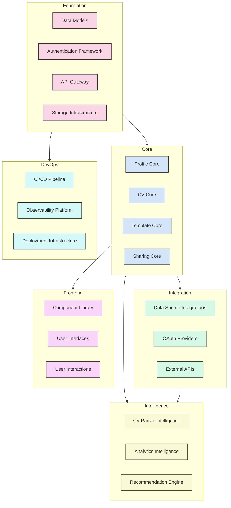
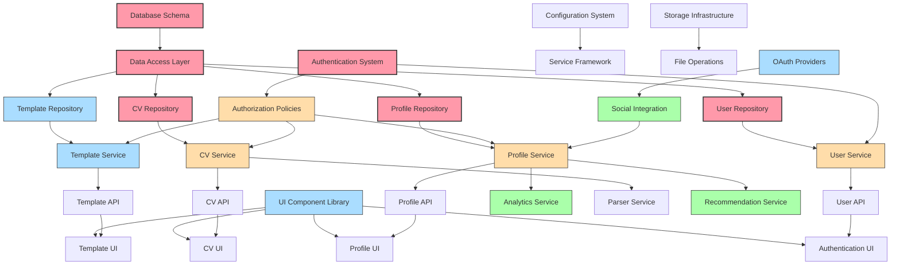
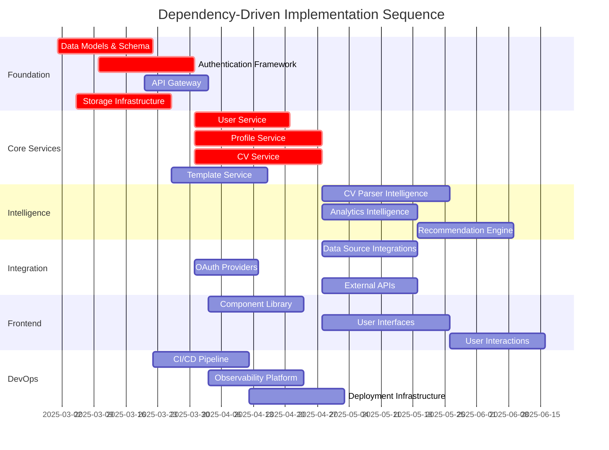
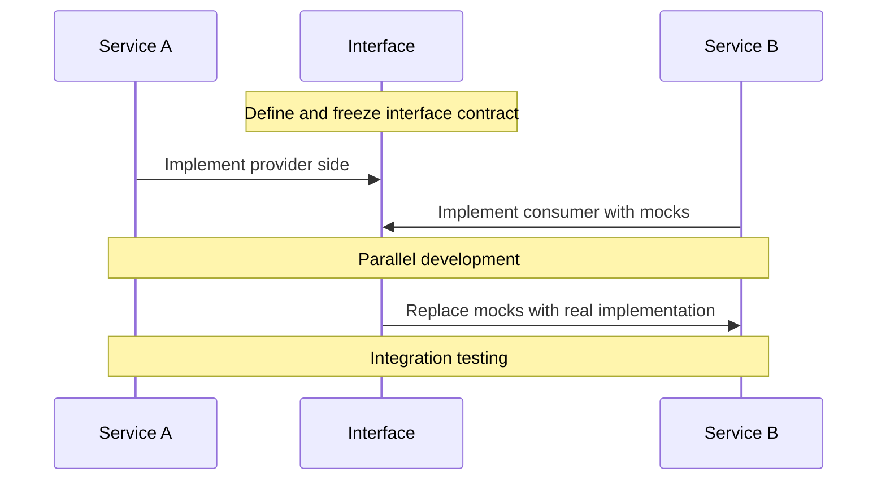
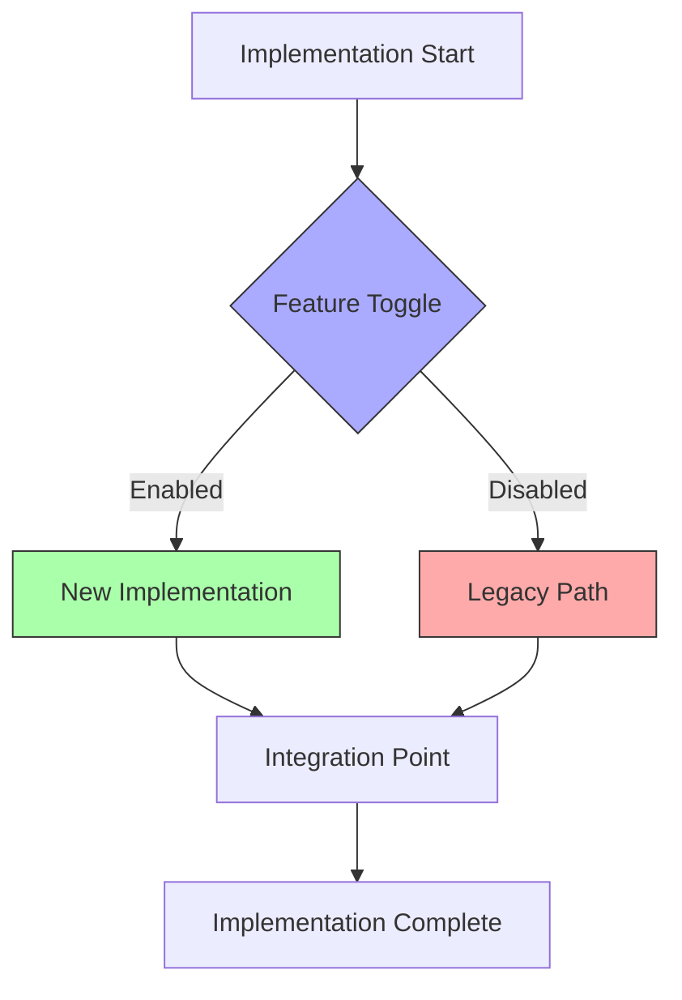

# Dependency-Driven Implementation Plan

## Executive Summary

This document provides a comprehensive implementation plan for the "Help Them Discover You" platform. Unlike traditional time-based project plans, this approach is structured around technical dependencies, focusing on resolving prerequisite components before advancing to dependent systems. This maximizes development parallelization while ensuring architectural integrity and technical excellence.

The implementation plan is designed for execution by the multi-agent development team defined in the team structure document, with clear responsibilities and interfaces between functional domains. It incorporates the system architecture, communication protocols, and API contracts as foundational elements guiding the implementation sequence.

## Implementation Principles

1. **Dependency Resolution Over Timing**: Progression is driven by technical prerequisites rather than calendar dates
2. **Interface-First Development**: Clear contracts between components enable parallel development
3. **Continuous Integration**: Regular integration validates dependencies are properly satisfied
4. **Quality Gates**: Components must meet established quality criteria before becoming dependencies
5. **Architectural Governance**: Implementation decisions validated against architectural principles

## Implementation Streams

The implementation is organized into parallel streams that can progress independently while respecting cross-stream dependencies.

## Dependency Map

The following dependency map illustrates the relationships between key components, highlighting which components must be completed before others can begin.

## Implementation Phases

The implementation is divided into phases based on dependency resolution, with each phase building upon the completed components from previous phases.

### Phase 1: Foundation

**Objective:** Establish the technical foundation for all subsequent development

#### Components:

1. **Data Models and Schema**
   - Complete database schema design
   - Implement core entity models
   - Set up migration framework
   - Validate data relationships

2. **Authentication Framework**
   - Implement user authentication system
   - Set up identity management
   - Configure OAuth providers
   - Implement authorization policies

3. **API Gateway**
   - Establish API routing and versioning
   - Implement request validation
   - Set up authentication middleware
   - Configure CORS and security headers

4. **Storage Infrastructure**
   - Configure object storage
   - Implement file upload/download services
   - Set up CDN integration
   - Implement caching mechanism

#### Dependencies:
- None (This is the foundational phase)

#### Quality Gates:
- Database schema validated against domain models
- Authentication system security review passed
- API gateway load testing successful
- Storage performance benchmarks met

### Phase 2: Core Services

**Objective:** Implement the core business services that form the backbone of the platform

#### Components:

1. **User Service**
   - Implement user management functionality
   - Set up profile association
   - Implement role-based permissions
   - Configure user settings management

2. **Profile Service**
   - Implement profile CRUD operations
   - Set up related entities (experience, education, skills)
   - Implement profile data validation
   - Configure profile visibility settings

3. **CV Service**
   - Implement CV storage and retrieval
   - Set up version control for CVs
   - Implement CV section management
   - Configure CV metadata handling

4. **Template Service**
   - Implement template CRUD operations
   - Set up template rendering engine
   - Implement template customization
   - Configure template sharing

#### Dependencies:
- Data Models and Schema
- Authentication Framework
- Storage Infrastructure

#### Quality Gates:
- Service API contracts validated against specifications
- Unit test coverage > 85%
- Performance benchmarks met
- Security review passed

### Phase 3: Intelligence Services

**Objective:** Add intelligent data processing and analysis capabilities

#### Components:

1. **CV Parser Intelligence**
   - Implement document processing pipeline
   - Set up OCR for scanned documents
   - Implement structure extraction algorithms
   - Configure entity recognition for CV data

2. **Analytics Intelligence**
   - Implement profile analytics calculation
   - Set up data aggregation pipelines
   - Implement visualization data preparation
   - Configure analytics caching

3. **Recommendation Engine**
   - Implement skills gap analysis
   - Set up career path recommendation
   - Implement profile improvement suggestions
   - Configure recommendation algorithms

#### Dependencies:
- Profile Service
- CV Service
- Storage Infrastructure

#### Quality Gates:
- Parser accuracy metrics above threshold
- Analytics calculation performance validated
- Recommendation relevance validated
- System resource utilization within limits

### Phase 4: Integration

**Objective:** Connect the platform with external data sources and services

#### Components:

1. **Data Source Integrations**
   - Implement LinkedIn data integration
   - Set up GitHub profile synchronization
   - Implement other relevant platform connectors
   - Configure data transformation pipelines

2. **OAuth Providers**
   - Implement social login providers
   - Set up secure token management
   - Implement permission scoping
   - Configure identity mapping

3. **External APIs**
   - Implement job board integrations
   - Set up skill taxonomy services
   - Implement industry data sources
   - Configure external API caching

#### Dependencies:
- Authentication Framework
- Profile Service
- CV Service

#### Quality Gates:
- Integration tests passed for all connectors
- OAuth security review completed
- Rate limiting and quota management implemented
- Error handling and recovery validated

### Phase 5: Frontend

**Objective:** Develop the user interface components and interaction patterns

#### Components:

1. **Component Library**
   - Implement shared UI components
   - Set up theming and styling system
   - Implement responsive design framework
   - Configure accessibility requirements

2. **User Interfaces**
   - Implement profile management interfaces
   - Set up CV editing and visualization
   - Implement template customization UI
   - Configure analytics dashboards

3. **User Interactions**
   - Implement drag-and-drop capabilities
   - Set up real-time collaboration features
   - Implement inline editing functionality
   - Configure user onboarding flows

#### Dependencies:
- User API
- Profile API
- CV API
- Template API

#### Quality Gates:
- UI component visual regression tests passed
- Accessibility audit passed
- Usability testing completed
- Cross-browser compatibility validated

### Phase 6: DevOps

**Objective:** Establish the operational infrastructure for the platform

#### Components:

1. **CI/CD Pipeline**
   - Implement build automation
   - Set up test automation
   - Implement deployment automation
   - Configure environment management

2. **Observability Platform**
   - Implement logging infrastructure
   - Set up monitoring and alerting
   - Implement distributed tracing
   - Configure performance dashboards

3. **Deployment Infrastructure**
   - Implement containerization
   - Set up orchestration platform
   - Implement network security
   - Configure scalability mechanisms

#### Dependencies:
- Foundation components

#### Quality Gates:
- CI/CD pipeline reliability metrics met
- Observability coverage validated
- Deployment reliability metrics met
- Security audit passed

## Implementation Sequence Diagram

The following diagram illustrates the dependency-driven implementation sequence, showing how components can be developed in parallel while respecting dependencies.

Note: This Gantt chart shows a dependency-driven sequence, not fixed calendar dates. Each component starts when its dependencies are completed, and the dates are illustrative only.

## Critical Path Analysis

Based on the dependency mapping, the following components form the critical path for implementation:

1. Data Models & Schema
2. Authentication Framework
3. User Service
4. Profile Service
5. CV Service
6. Component Library
7. User Interfaces

These components should receive priority attention and resources, as delays in their completion will impact the overall implementation timeline.

## Parallel Development Strategies

To maximize development velocity while respecting dependencies, the following strategies are employed:

### 1. Interface-First Development

### 2. Feature Toggles

### 3. Vertical Slices

For each major feature, implement a thin vertical slice through all layers to validate the architecture and dependencies early.

```mermaid
flowchart TD
    subgraph "Vertical Slice 1: Basic Profile"
        UI1[Profile UI]
        API1[Profile API]
        Service1[Profile Service]
        DB1[Profile Schema]
    end
    
    subgraph "Vertical Slice 2: CV Upload"
        UI2[CV Upload UI]
        API2[CV API]
        Service2[CV Service]
        DB2[CV Schema]
    end
    
    subgraph "Vertical Slice 3: Template"
        UI3[Template UI]
        API3[Template API]
        Service3[Template Service]
        DB3[Template Schema]
    end
    
    UI1 --> API1
    API1 --> Service1
    Service1 --> DB1
    
    UI2 --> API2
    API2 --> Service2
    Service2 --> DB2
    
    UI3 --> API3
    API3 --> Service3
    Service3 --> DB3
    
    classDef ui fill:#f9d5e5,stroke:#333,stroke-width:1px
    classDef api fill:#d5e5f9,stroke:#333,stroke-width:1px
    classDef service fill:#f9f9d5,stroke:#333,stroke-width:1px
    classDef db fill:#d5f9e5,stroke:#333,stroke-width:1px
    
    class UI1,UI2,UI3 ui
    class API1,API2,API3 api
    class Service1,Service2,Service3 service
    class DB1,DB2,DB3 db
```

## Risk Management

The following risks have been identified for the implementation plan, along with mitigation strategies:

| Risk | Impact | Probability | Mitigation Strategy |
|------|--------|------------|---------------------|
| Incomplete dependency identification | High | Medium | Comprehensive architecture review; regular dependency validation |
| Interface changes affecting multiple components | High | Medium | Interface contracts with versioning; change management process |
| Delayed critical path components | High | Medium | Resource flexibility; parallel implementation with mocks |
| Integration failures | Medium | High | Continuous integration; automated testing; integration environments |
| Complex dependency chains | Medium | Medium | Architectural refactoring to reduce coupling; clear interface boundaries |
| Technical debt from temporary solutions | Medium | High | Technical debt tracking; scheduled refactoring; code quality metrics |
| Performance issues discovered late | High | Medium | Early performance testing; scalability by design; performance budgets |
| Security vulnerabilities | High | Medium | Security by design; regular security reviews; automated security testing |

## Dependency Tracking

Progress will be tracked based on dependency resolution rather than calendar-based milestones. The following metrics will be used:

1. **Dependency Resolution Rate**: Percentage of identified dependencies successfully resolved
2. **Blocking Issues**: Number of components blocked by unresolved dependencies
3. **Critical Path Progress**: Percentage completion of critical path components
4. **Technical Debt Ratio**: Measure of temporary solutions vs. proper implementations
5. **Integration Success Rate**: Percentage of successful component integrations

## Conclusion

This dependency-driven implementation plan provides a structured approach to building the "Help Them Discover You" platform. By focusing on resolving technical dependencies in the proper sequence, the plan enables parallel development while maintaining architectural integrity.

The plan incorporates flexibility to adapt to evolving requirements and technical discoveries, with an emphasis on continuous integration and validation to ensure components work together effectively. By following this dependency-driven approach, the implementation team can deliver a robust, scalable platform that meets the needs of users while adhering to technical excellence standards.