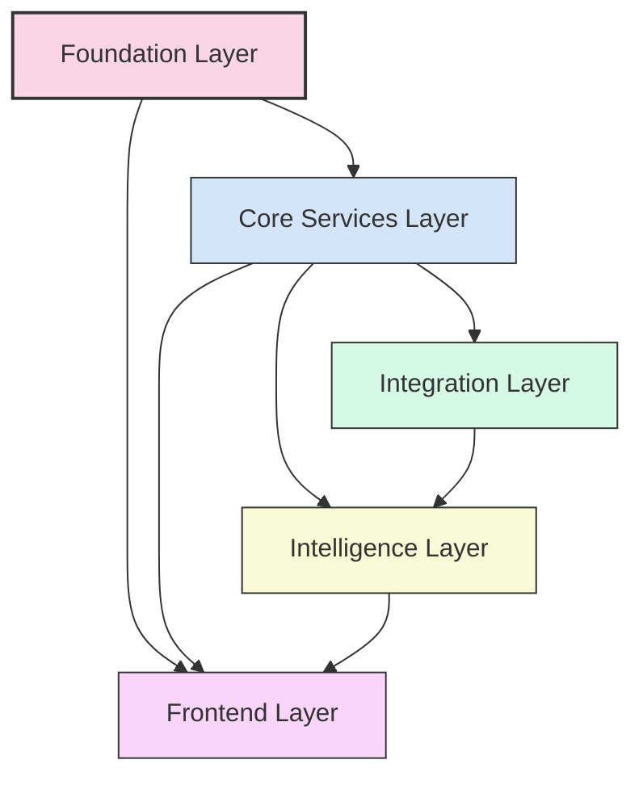

# Help Them Discover You: Platform Architecture

## Overview

This architecture documentation provides a comprehensive dependency-driven framework for implementing the "Help Them Discover You" platform. The architecture prioritizes technical excellence through a focus on dependency resolution, clear interfaces, and modular design.

## Architecture Documents

| Document                                                                  | Description                                                                 | Key Content                                                                                 |
|---------------------------------------------------------------------------|-----------------------------------------------------------------------------|---------------------------------------------------------------------------------------------|
| [System Architecture](./system-architecture.md)                           | Comprehensive visualization of platform architecture                        | Component relationships, data flows, deployment architecture, sequence diagrams             |
| [Dependency-Driven Implementation](./dependency-driven-implementation.md) | Framework for prioritizing technical prerequisites over time-based planning | Core principles, dependency mapping, resolution workflow, decision process                  |
| [Communication Protocols](./communication-protocols.md)                   | Standardized interfaces between system components                           | Protocol layering, RESTful API, GraphQL, event-based protocols, WebSockets                  |
| [API Contracts](./api-contracts.md)                                       | Definitions of API endpoints and data models                                | Core data models, API endpoints, service interfaces, dependency mappings                    |
| [Multi-Agent Team Structure](./multi-agent-team-structure.md)             | Organization of the development team                                        | Team organization, role definitions, interface definitions, communication protocols         |
| [Implementation Plan](./implementation-plan.md)                           | Comprehensive implementation approach                                       | Implementation streams, dependency map, implementation phases, critical path analysis       |
| [Dependency-Driven Roadmap](./dependency-driven-roadmap.md)               | Strategic implementation journey                                            | Milestone progression, dependency gates, progress tracking metrics, feature readiness model |

## Architectural Principles

The platform architecture is guided by the following core principles:

### 1. Dependency-Driven Development

Progress is determined by resolving technical dependencies rather than arbitrary time-based milestones. This ensures that components are implemented in a logical sequence that respects technical prerequisites.

### 2. Interface-First Development

Clear interface contracts are defined before implementation, enabling parallel development of components while ensuring they will integrate properly.

### 3. Modular Architecture

The system is designed with well-defined boundaries between components, allowing for independent development, testing, and deployment.

### 4. Scalable by Design

All components are designed to scale horizontally, with considerations for performance, resilience, and load distribution.

### 5. Security by Design

Security considerations are integrated into the architecture from the beginning, not added as an afterthought.

## Dependency Graph Overview

The following diagram illustrates the high-level dependencies between major architectural components:

## Implementation Approach

The implementation follows a dependency-driven approach with these key characteristics:

1. **Component Dependencies**: Each component explicitly defines its dependencies
2. **Dependency Resolution**: Development prioritizes resolving dependencies to unblock dependent components
3. **Parallel Development**: Components without mutual dependencies are developed in parallel
4. **Continuous Integration**: Regular integration validates that dependencies work together correctly
5. **Iterative Enhancement**: Components can be enhanced iteratively after their core dependencies are satisfied

## Technical Excellence Commitments

The architecture emphasizes technical excellence through:

1. **Clear Interfaces**: Well-defined APIs and contracts between components
2. **Automated Testing**: Comprehensive test coverage at all levels
3. **Performance Standards**: Explicit performance requirements for each component
4. **Security Guidelines**: Integrated security practices across all layers
5. **Documentation**: Thorough documentation of all interfaces and dependencies

## Getting Started

To understand the platform architecture:

1. Start with the [System Architecture](./system-architecture.md) for a high-level overview
2. Review the [Dependency-Driven Implementation](./dependency-driven-implementation.md) framework
3. Explore the [API Contracts](./api-contracts.md) and [Communication Protocols](./communication-protocols.md)
4. Understand the [Multi-Agent Team Structure](./multi-agent-team-structure.md)
5. Review the [Implementation Plan](./implementation-plan.md) for the execution approach
6. Examine the [Dependency-Driven Roadmap](./dependency-driven-roadmap.md) for the strategic implementation journey