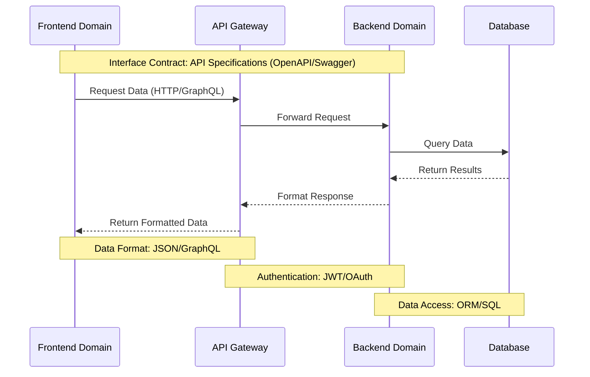
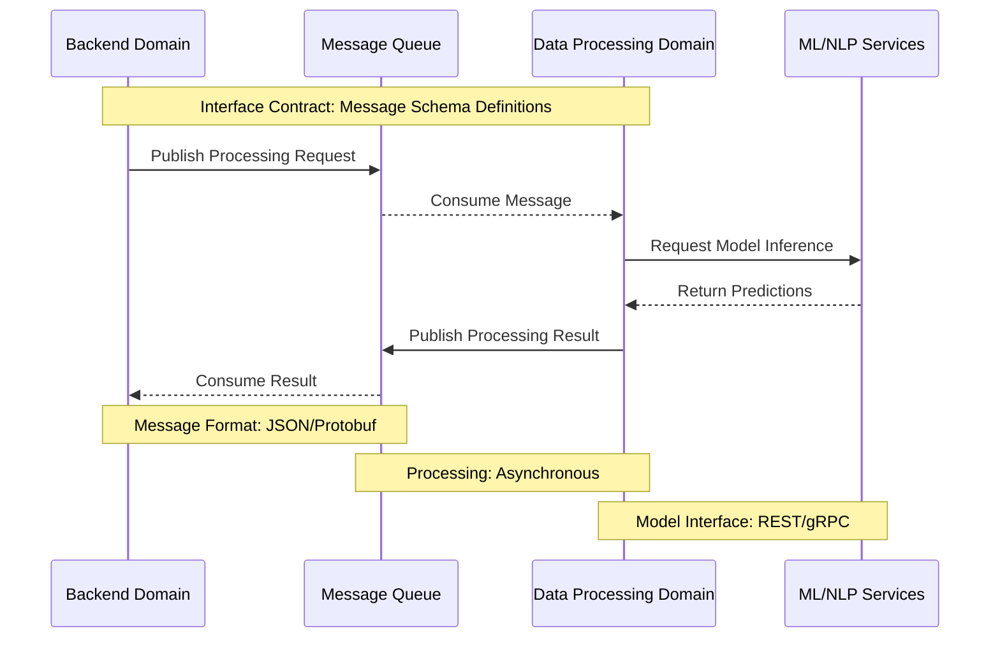
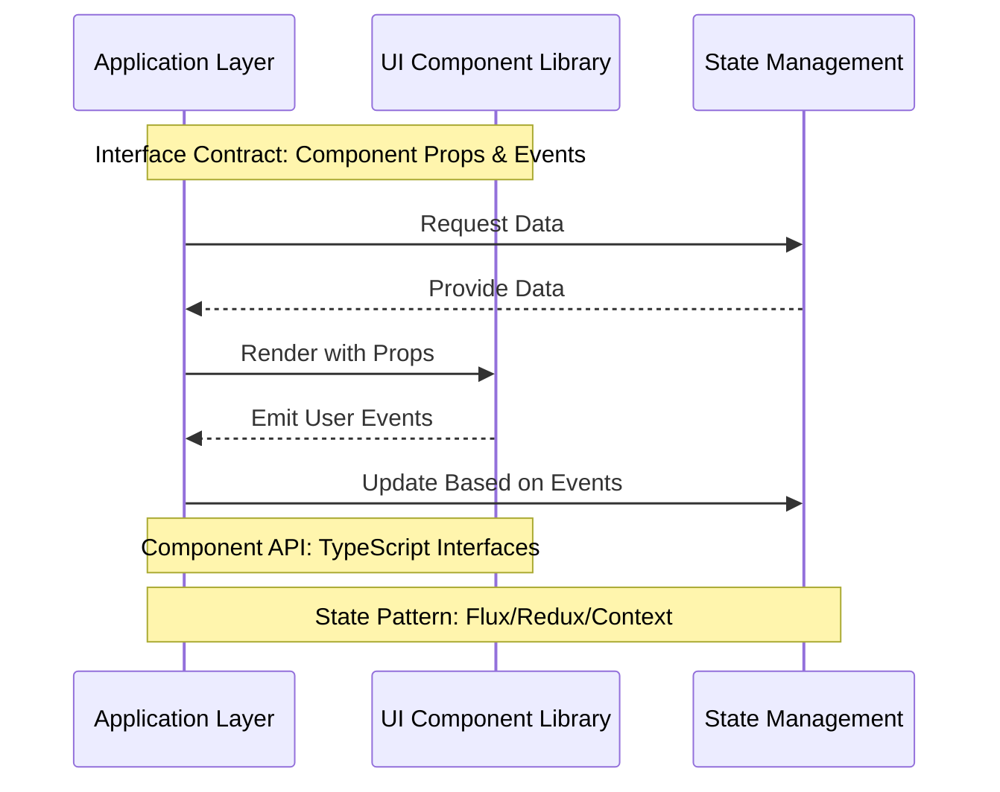
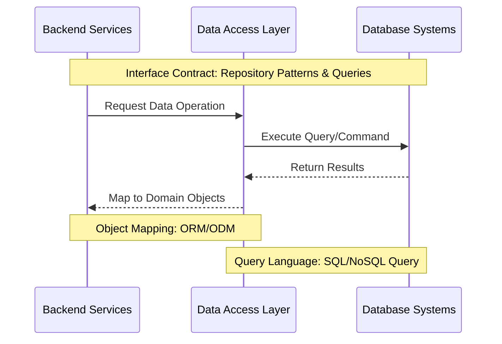
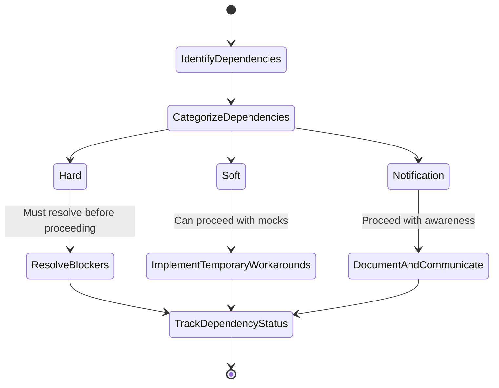

# Multi-Agent AI Development Team Structure

## Overview

This document defines the comprehensive AI development team structure for the "Help Them Discover You" platform. The team is organized into specialized roles with distinct responsibilities and clear interfaces between functional domains. This structure enables parallel workflow execution based on dependency resolution rather than time-based progression.

## Team Organization Structure

```mermaid
graph TD
    ChiefArchitect[Chief Architect] --> SystemArchitect[System Architect]
    ChiefArchitect --> SecurityArchitect[Security Architect]
    ChiefArchitect --> DataArchitect[Data Architect]
    
    SystemArchitect --> FrontendLead[Frontend Lead]
    SystemArchitect --> BackendLead[Backend Lead]
    SystemArchitect --> DataProcessingLead[Data Processing Lead]
    
    FrontendLead --> UIEngineer[UI Engineer]
    FrontendLead --> ReactEngineer[React Engineer]
    FrontendLead --> UXEngineer[UX Engineer]
    
    BackendLead --> APIEngineer[API Engineer]
    BackendLead --> DatabaseEngineer[Database Engineer]
    BackendLead --> IntegrationEngineer[Integration Engineer]
    
    DataProcessingLead --> MLEngineer[ML Engineer]
    DataProcessingLead --> DataEngineer[Data Engineer]
    DataProcessingLead --> NLPEngineer[NLP Engineer]
    
    SecurityArchitect --> SecurityEngineer[Security Engineer]
    
    DataArchitect --> DataModelingEngineer[Data Modeling Engineer]
    DataArchitect --> AnalyticsEngineer[Analytics Engineer]
    
    QALead[QA Lead] --> TestAutomationEngineer[Test Automation Engineer]
    QALead --> PerformanceTester[Performance Tester]
    QALead --> SecurityTester[Security Tester]
    
    DevOpsLead[DevOps Lead] --> InfrastructureEngineer[Infrastructure Engineer]
    DevOpsLead --> CICDEngineer[CI/CD Engineer]
    DevOpsLead --> ObservabilityEngineer[Observability Engineer]
    
    %% Define agent roles with styles
    classDef architect fill:#f9d5e5,stroke:#333,stroke-width:1px
    classDef lead fill:#eeeeee,stroke:#333,stroke-width:1px
    classDef engineer fill:#d5f9e8,stroke:#333,stroke-width:1px
    
    %% Apply styles to nodes
    class ChiefArchitect,SystemArchitect,SecurityArchitect,DataArchitect architect
    class FrontendLead,BackendLead,DataProcessingLead,QALead,DevOpsLead lead
    class UIEngineer,ReactEngineer,UXEngineer,APIEngineer,DatabaseEngineer,IntegrationEngineer,MLEngineer,DataEngineer,NLPEngineer,SecurityEngineer,DataModelingEngineer,AnalyticsEngineer,TestAutomationEngineer,PerformanceTester,SecurityTester,InfrastructureEngineer,CICDEngineer,ObservabilityEngineer engineer
```

## Role Definitions and Responsibilities

### Architectural Leadership

#### Chief Architect
- **Primary Responsibilities:**
  - Overall technical vision and architectural governance
  - Cross-cutting concerns and architectural decisions
  - Dependency management across all domains
  - Technical risk assessment and mitigation
- **Dependencies:**
  - None (highest level role)
- **Deliverables:**
  - System architecture documentation
  - Technical decision records
  - Architectural review processes
  - Cross-team coordination framework

#### System Architect
- **Primary Responsibilities:**
  - Component-level architecture design
  - Interface specifications between subsystems
  - Technology stack selection and governance
  - Performance and scalability standards
- **Dependencies:**
  - Chief Architect (approvals and direction)
- **Deliverables:**
  - Detailed system component diagrams
  - Interface contracts
  - Technology compatibility matrix
  - System scalability plans

#### Security Architect
- **Primary Responsibilities:**
  - Security framework design
  - Authentication and authorization models
  - Compliance requirements mapping
  - Security policy development
- **Dependencies:**
  - Chief Architect (approvals and direction)
- **Deliverables:**
  - Security architecture documentation
  - Authentication flow specifications
  - Data protection standards
  - Compliance documentation

#### Data Architect
- **Primary Responsibilities:**
  - Data model design
  - Database schema architecture
  - Data flow optimization
  - Data governance policies
- **Dependencies:**
  - Chief Architect (approvals and direction)
- **Deliverables:**
  - Entity relationship diagrams
  - Data flow models
  - Schema evolution strategies
  - Data governance documentation

### Stream Leadership

#### Frontend Lead
- **Primary Responsibilities:**
  - Frontend architecture and patterns
  - Component library management
  - State management strategy
  - Frontend performance optimization
- **Dependencies:**
  - System Architect (interface specifications)
- **Deliverables:**
  - Frontend architecture documentation
  - Component specifications
  - State management patterns
  - Style guide and design system implementation

#### Backend Lead
- **Primary Responsibilities:**
  - API design and implementation
  - Service architecture
  - Data access patterns
  - Backend performance optimization
- **Dependencies:**
  - System Architect (interface specifications)
  - Data Architect (data models)
- **Deliverables:**
  - API documentation
  - Service specifications
  - Database access patterns
  - Backend performance standards

#### Data Processing Lead
- **Primary Responsibilities:**
  - Data processing pipeline architecture
  - ML/NLP integration strategy
  - ETL process design
  - Data processing performance optimization
- **Dependencies:**
  - System Architect (interface specifications)
  - Data Architect (data models)
- **Deliverables:**
  - Data processing architecture
  - ML/NLP integration documentation
  - Processing pipeline specifications
  - Performance optimization strategies

#### QA Lead
- **Primary Responsibilities:**
  - Testing strategy development
  - Quality metrics definition
  - Test coverage requirements
  - Defect management process
- **Dependencies:**
  - System Architect (system specifications)
- **Deliverables:**
  - Testing strategy documentation
  - Quality metrics framework
  - Test coverage reports
  - Defect management procedures

#### DevOps Lead
- **Primary Responsibilities:**
  - CI/CD pipeline architecture
  - Infrastructure as code strategy
  - Deployment automation
  - Monitoring and observability framework
- **Dependencies:**
  - System Architect (system specifications)
  - Security Architect (security requirements)
- **Deliverables:**
  - CI/CD pipeline documentation
  - Infrastructure code specifications
  - Deployment procedures
  - Monitoring and alerting configuration

### Frontend Domain

#### UI Engineer
- **Primary Responsibilities:**
  - UI component implementation
  - Responsive design implementation
  - Accessibility compliance
  - Visual consistency enforcement
- **Dependencies:**
  - Frontend Lead (component specifications)
  - UX Engineer (design specifications)
- **Deliverables:**
  - UI component library
  - Responsive layouts
  - Accessibility-compliant components
  - Visual design implementation

#### React Engineer
- **Primary Responsibilities:**
  - React component architecture
  - State management implementation
  - Data fetching integration
  - Component lifecycle optimization
- **Dependencies:**
  - Frontend Lead (architecture patterns)
  - API Engineer (API contracts)
- **Deliverables:**
  - React component implementations
  - State management solutions
  - API integration code
  - Performance-optimized components

#### UX Engineer
- **Primary Responsibilities:**
  - User interaction design
  - Information architecture
  - Usability testing
  - User journey mapping
- **Dependencies:**
  - Frontend Lead (design system guidelines)
- **Deliverables:**
  - Interaction specifications
  - Information architecture documentation
  - Usability test reports
  - User journey maps

### Backend Domain

#### API Engineer
- **Primary Responsibilities:**
  - API implementation
  - Request/response handling
  - API documentation
  - API versioning strategy
- **Dependencies:**
  - Backend Lead (API specifications)
  - Database Engineer (data access patterns)
- **Deliverables:**
  - API implementations
  - API documentation
  - Request/response handlers
  - Versioning implementation

#### Database Engineer
- **Primary Responsibilities:**
  - Database implementation
  - Query optimization
  - Data migration scripts
  - Database performance tuning
- **Dependencies:**
  - Backend Lead (data access patterns)
  - Data Architect (schema designs)
- **Deliverables:**
  - Database schema implementations
  - Optimized queries
  - Migration scripts
  - Performance tuning documentation

#### Integration Engineer
- **Primary Responsibilities:**
  - External system integration
  - API client implementation
  - Authentication integration
  - Webhook handlers
- **Dependencies:**
  - Backend Lead (integration specifications)
  - Security Engineer (security requirements)
- **Deliverables:**
  - Integration implementations
  - API client code
  - Authentication integrations
  - Webhook handling code

### Data Processing Domain

#### ML Engineer
- **Primary Responsibilities:**
  - Machine learning model development
  - Model training pipelines
  - Model serving infrastructure
  - Model performance optimization
- **Dependencies:**
  - Data Processing Lead (ML strategy)
  - Data Engineer (data pipelines)
- **Deliverables:**
  - Machine learning models
  - Training pipelines
  - Inference APIs
  - Model performance metrics

#### Data Engineer
- **Primary Responsibilities:**
  - Data pipeline implementation
  - ETL process development
  - Data validation rules
  - Data quality monitoring
- **Dependencies:**
  - Data Processing Lead (pipeline specifications)
  - Data Architect (data models)
- **Deliverables:**
  - Data pipeline implementations
  - ETL processes
  - Data validation components
  - Data quality monitoring tools

#### NLP Engineer
- **Primary Responsibilities:**
  - Natural language processing implementation
  - Text extraction and classification
  - Entity recognition
  - NLP model tuning
- **Dependencies:**
  - Data Processing Lead (NLP strategy)
  - ML Engineer (model infrastructure)
- **Deliverables:**
  - NLP model implementations
  - Text processing pipelines
  - Entity extraction components
  - NLP performance metrics

### Cross-Cutting Domains

#### Security Engineer
- **Primary Responsibilities:**
  - Security control implementation
  - Authentication implementation
  - Security testing
  - Vulnerability management
- **Dependencies:**
  - Security Architect (security specifications)
- **Deliverables:**
  - Security control implementations
  - Authentication systems
  - Security test reports
  - Vulnerability management procedures

#### Data Modeling Engineer
- **Primary Responsibilities:**
  - Detailed data model implementation
  - Data normalization
  - Data relationship management
  - Schema evolution
- **Dependencies:**
  - Data Architect (data model designs)
- **Deliverables:**
  - Implemented data models
  - Normalization documentation
  - Relationship implementations
  - Schema evolution scripts

#### Analytics Engineer
- **Primary Responsibilities:**
  - Analytics infrastructure implementation
  - Data visualization components
  - Reporting pipelines
  - Metrics calculation
- **Dependencies:**
  - Data Architect (data models)
  - Data Engineer (data pipelines)
- **Deliverables:**
  - Analytics infrastructure
  - Visualization components
  - Reporting systems
  - Metrics calculation pipelines

### Quality Assurance

#### Test Automation Engineer
- **Primary Responsibilities:**
  - Automated test development
  - Test framework implementation
  - Continuous testing integration
  - Test data management
- **Dependencies:**
  - QA Lead (testing strategy)
- **Deliverables:**
  - Automated test suites
  - Test frameworks
  - CI test integration
  - Test data management solutions

#### Performance Tester
- **Primary Responsibilities:**
  - Performance test development
  - Load testing
  - Stress testing
  - Performance benchmarking
- **Dependencies:**
  - QA Lead (performance requirements)
- **Deliverables:**
  - Performance test suites
  - Load test scenarios
  - Stress test implementations
  - Performance benchmark reports

#### Security Tester
- **Primary Responsibilities:**
  - Security test development
  - Penetration testing
  - Vulnerability scanning
  - Compliance validation
- **Dependencies:**
  - QA Lead (security test requirements)
  - Security Architect (security specifications)
- **Deliverables:**
  - Security test suites
  - Penetration test results
  - Vulnerability scan reports
  - Compliance validation reports

### DevOps

#### Infrastructure Engineer
- **Primary Responsibilities:**
  - Infrastructure as code implementation
  - Cloud resource provisioning
  - Network configuration
  - Resource optimization
- **Dependencies:**
  - DevOps Lead (infrastructure specifications)
- **Deliverables:**
  - Infrastructure code
  - Cloud resource configurations
  - Network setups
  - Resource optimization implementations

#### CI/CD Engineer
- **Primary Responsibilities:**
  - CI/CD pipeline implementation
  - Build automation
  - Deployment automation
  - Release management
- **Dependencies:**
  - DevOps Lead (CI/CD specifications)
- **Deliverables:**
  - CI/CD pipeline implementations
  - Build scripts
  - Deployment automations
  - Release management procedures

#### Observability Engineer
- **Primary Responsibilities:**
  - Monitoring system implementation
  - Logging infrastructure
  - Alerting configuration
  - Dashboards and visualization
- **Dependencies:**
  - DevOps Lead (observability requirements)
- **Deliverables:**
  - Monitoring implementations
  - Logging systems
  - Alerting configurations
  - Dashboards and visualizations

## Interface Definitions Between Domains

### Frontend to Backend Interface

### Backend to Data Processing Interface

### Frontend to UI Interface

### Backend to Database Interface

## Dependency Resolution Framework

### Dependency Types

1. **Hard Dependencies**: Must be resolved before work can begin
   - API contracts before implementation
   - Data models before database schema
   - Authentication framework before security implementation

2. **Soft Dependencies**: Can be worked around temporarily
   - UI implementation with mock data
   - Backend services with mock responses
   - Integration tests with mock external systems

3. **Notification Dependencies**: Require awareness but not blocking
   - Performance impact changes
   - Schema evolutions
   - API version deprecations

### Dependency Management Process

### Dependency Resolution Workflow

1. **Dependency Identification**
   - During task planning
   - Through architectural reviews
   - Via cross-team communication

2. **Dependency Documentation**
   - Explicit dependency listing in tasks
   - Dependency graphs for complex features
   - Automated dependency tracking where possible

3. **Resolution Strategies**
   - Interface-first development
   - Mock implementations
   - Progressive integration
   - Feature toggles

4. **Progress Tracking**
   - Dependency resolution status in task management
   - Blockers highlighted in daily standups
   - Dependency-based critical path analysis

## Communication Protocols

### Synchronization Mechanisms

1. **Interface Definition Repository**
   - Central location for all contracts and interfaces
   - Version-controlled specifications
   - Automated validation and testing

2. **Cross-Domain Working Groups**
   - Regular synchronization meetings
   - Focused on interface boundaries
   - Representation from dependent teams

3. **Dependency Resolution Board**
   - Prioritization of blocking dependencies
   - Resource allocation for critical path items
   - Escalation path for delayed dependencies

### Documentation Standards

1. **Interface Contracts**
   - OpenAPI/Swagger for REST APIs
   - GraphQL schema for GraphQL APIs
   - TypeScript interfaces for component props
   - JSON Schema for data models

2. **Technical Decision Records**
   - Standard format for architecture decisions
   - Explicit listing of dependencies and impacts
   - Approval workflow based on dependency scope

3. **Integration Documentation**
   - Sequence diagrams for cross-domain workflows
   - Component diagrams showing dependencies
   - Data flow diagrams for complex processes

## Conclusion

This multi-agent development team structure provides a comprehensive framework for implementing the "Help Them Discover You" platform using a dependency-driven approach. By clearly defining roles, responsibilities, and interfaces between functional domains, the team can operate in parallel while maintaining coordination through well-defined dependency resolution processes.

The structure prioritizes autonomous decision-making within established architectural boundaries while ensuring that dependencies are properly identified, tracked, and resolved to maintain development velocity without sacrificing technical excellence.