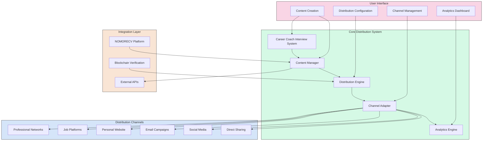
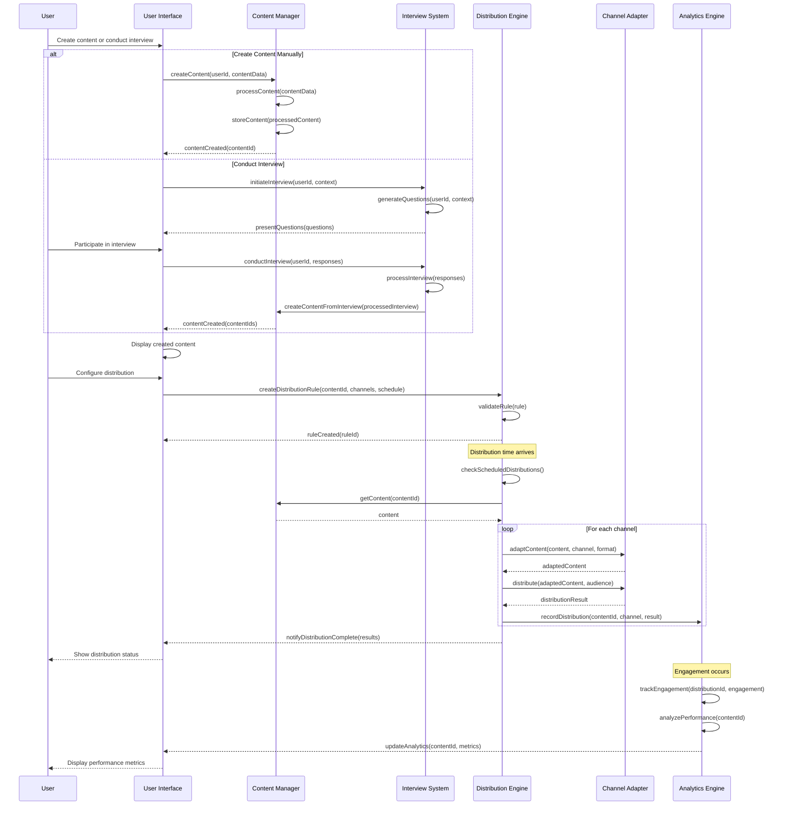

# Content Distribution Mechanism

## Overview

The Content Distribution Mechanism is a critical component of our platform that enables professionals to strategically distribute their value demonstrations across various channels. Unlike traditional resume distribution, this system focuses on sharing evidence-based demonstrations of capabilities through multiple formats and channels, with intelligent tagging for automated distribution.

This document outlines the architecture, components, and implementation approach for the Content Distribution Mechanism, including the newly added career coach consultant interview component.

## Design Principles

1. **Channel-Agnostic Distribution**: Enable content distribution across multiple channels without rebuilding distribution functionality for each
2. **Intelligent Content Tagging**: Allow users to tag content for automated distribution based on relevance and context
3. **Format Adaptation**: Automatically adapt content to suit different distribution channels
4. **Engagement Analytics**: Track content performance across channels to optimize distribution strategies
5. **Privacy Control**: Provide granular control over what information is shared and with whom
6. **Integration Flexibility**: Support both standalone operation and integration with existing systems like NOMORECV
7. **Verification Preservation**: Maintain credential verification across distribution channels
8. **Interactive Demonstration**: Prioritize interactive demonstrations of capabilities over static declarations

## System Architecture



## Core Components

### 1. Content Manager

The Content Manager handles the creation, storage, and organization of distributable content derived from the user's professional profile and value demonstrations.

**Key Features**:

- **Content Repository**: Central storage for all distributable content
- **Format Conversion**: Transform content between different formats (text, video, audio, interactive)
- **Content Versioning**: Track changes and maintain version history
- **Content Tagging**: Apply metadata tags for intelligent distribution
- **Content Approval Workflow**: Optional review process before distribution

**Integration with NOMORECV**:

The Content Manager can integrate with NOMORECV's Profile Service and CV Parser to import professional data as a foundation for creating distributable content. This allows NOMORECV to serve as a data gathering function while our system handles the distribution aspect.

### 2. Distribution Engine

The Distribution Engine orchestrates the strategic distribution of content across various channels based on user-defined rules and content tags.

**Key Features**:

- **Distribution Rules Engine**: Define when, where, and how content is distributed
- **Scheduling System**: Plan content distribution over time
- **Audience Targeting**: Target specific audiences based on content relevance
- **Distribution Triggers**: Event-based triggers for automated distribution
- **Distribution Throttling**: Prevent over-distribution and channel fatigue

**Implementation Approach**:

```javascript
// Distribution rule definition
const distributionRule = {
  contentType: 'project-showcase',
  tags: ['artificial-intelligence', 'leadership', 'innovation'],
  channels: [
    {
      type: 'linkedin',
      format: 'article',
      audience: 'tech-professionals',
      schedule: {
        type: 'one-time',
        datetime: '2025-05-15T10:00:00Z'
      }
    },
    {
      type: 'email-campaign',
      format: 'newsletter',
      audience: 'potential-clients',
      schedule: {
        type: 'recurring',
        pattern: 'weekly',
        dayOfWeek: 'tuesday',
        time: '09:00:00',
        timezone: 'America/New_York'
      }
    },
    {
      type: 'personal-website',
      format: 'interactive',
      audience: 'all-visitors',
      schedule: {
        type: 'immediate'
      }
    }
  ],
  verificationLevel: 'include-badges',
  analytics: {
    trackEngagement: true,
    trackConversions: true,
    conversionGoals: ['profile-view', 'contact-request']
  }
};

// Distribution engine execution
async function executeDistribution(contentId, rules) {
  const content = await contentManager.getContent(contentId);
  
  // Validate content against rules
  if (!validateContentForRules(content, rules)) {
    return {
      status: 'rejected',
      reason: 'Content does not meet distribution rules'
    };
  }
  
  // Process each channel
  const distributionResults = await Promise.all(
    rules.channels.map(async channel => {
      // Check if distribution should occur now
      if (!shouldDistributeNow(channel.schedule)) {
        return {
          channel: channel.type,
          status: 'scheduled',
          scheduledTime: getNextDistributionTime(channel.schedule)
        };
      }
      
      // Adapt content for channel
      const adaptedContent = await channelAdapter.adaptContent(
        content,
        channel.type,
        channel.format
      );
      
      // Distribute to channel
      const result = await channelAdapter.distribute(
        channel.type,
        adaptedContent,
        {
          audience: channel.audience,
          verificationLevel: rules.verificationLevel
        }
      );
      
      // Record analytics event
      await analyticsEngine.recordDistribution({
        contentId,
        channelType: channel.type,
        distributionTime: new Date(),
        result
      });
      
      return {
        channel: channel.type,
        status: result.success ? 'distributed' : 'failed',
        distributionId: result.distributionId,
        errors: result.errors
      };
    })
  );
  
  return {
    status: 'completed',
    results: distributionResults
  };
}
```

### 3. Channel Adapter

The Channel Adapter provides standardized interfaces for distributing content to various channels, handling the specific requirements and formats of each channel.

**Key Features**:

- **Channel Connectors**: Standardized interfaces for different distribution channels
- **Format Adaptation**: Adapt content format to channel requirements
- **Authentication Management**: Handle authentication for different channels
- **Rate Limiting**: Respect channel-specific rate limits and quotas
- **Error Handling**: Manage channel-specific errors and retry logic

**Supported Channels**:

1. **Professional Networks**: LinkedIn, Indeed, Glassdoor
2. **Job Platforms**: Monster, CareerBuilder, ZipRecruiter
3. **Personal Website**: WordPress, Wix, Custom Sites
4. **Email Campaigns**: Mailchimp, SendGrid, Custom Email
5. **Social Media**: Twitter, Facebook, Instagram
6. **Direct Sharing**: Email, SMS, Messaging Apps

**Implementation Approach**:

```typescript
// Channel adapter interface
interface ChannelAdapter {
  // Check if channel is configured and available
  checkAvailability(): Promise<boolean>;
  
  // Adapt content for specific channel and format
  adaptContent(
    content: Content,
    format: string,
    options?: AdaptationOptions
  ): Promise<AdaptedContent>;
  
  // Distribute content to channel
  distribute(
    adaptedContent: AdaptedContent,
    audience: Audience,
    options?: DistributionOptions
  ): Promise<DistributionResult>;
  
  // Get distribution status
  getDistributionStatus(
    distributionId: string
  ): Promise<DistributionStatus>;
  
  // Update or delete distributed content
  updateDistribution(
    distributionId: string,
    updates: ContentUpdates
  ): Promise<UpdateResult>;
  
  // Get engagement metrics for distribution
  getEngagementMetrics(
    distributionId: string
  ): Promise<EngagementMetrics>;
}

// LinkedIn channel adapter implementation
class LinkedInChannelAdapter implements ChannelAdapter {
  private apiClient: LinkedInApiClient;
  private contentAdapter: LinkedInContentAdapter;
  
  constructor(
    credentials: LinkedInCredentials,
    options?: LinkedInAdapterOptions
  ) {
    this.apiClient = new LinkedInApiClient(credentials);
    this.contentAdapter = new LinkedInContentAdapter(options);
  }
  
  async checkAvailability(): Promise<boolean> {
    try {
      await this.apiClient.verifyCredentials();
      return true;
    } catch (error) {
      console.error('LinkedIn availability check failed:', error);
      return false;
    }
  }
  
  async adaptContent(
    content: Content,
    format: string,
    options?: AdaptationOptions
  ): Promise<AdaptedContent> {
    switch (format) {
      case 'post':
        return this.contentAdapter.adaptForPost(content, options);
      case 'article':
        return this.contentAdapter.adaptForArticle(content, options);
      case 'profile-section':
        return this.contentAdapter.adaptForProfileSection(content, options);
      default:
        throw new Error(`Unsupported LinkedIn format: ${format}`);
    }
  }
  
  async distribute(
    adaptedContent: AdaptedContent,
    audience: Audience,
    options?: DistributionOptions
  ): Promise<DistributionResult> {
    try {
      let distributionId;
      
      switch (adaptedContent.format) {
        case 'post':
          const postResult = await this.apiClient.createPost(
            adaptedContent.content,
            this.mapAudienceToVisibility(audience),
            options?.distributionSettings
          );
          distributionId = postResult.id;
          break;
        case 'article':
          const articleResult = await this.apiClient.publishArticle(
            adaptedContent.content,
            this.mapAudienceToVisibility(audience),
            options?.distributionSettings
          );
          distributionId = articleResult.id;
          break;
        case 'profile-section':
          const profileResult = await this.apiClient.updateProfileSection(
            adaptedContent.content,
            options?.distributionSettings
          );
          distributionId = profileResult.id;
          break;
      }
      
      return {
        success: true,
        distributionId,
        timestamp: new Date(),
        channel: 'linkedin',
        format: adaptedContent.format
      };
    } catch (error) {
      console.error('LinkedIn distribution failed:', error);
      return {
        success: false,
        errors: [error.message],
        timestamp: new Date(),
        channel: 'linkedin',
        format: adaptedContent.format
      };
    }
  }
  
  // Implementation of other interface methods...
  
  private mapAudienceToVisibility(audience: Audience): string {
    // Map audience settings to LinkedIn visibility options
    switch (audience.type) {
      case 'public':
        return 'PUBLIC';
      case 'connections':
        return 'CONNECTIONS';
      case 'targeted':
        return audience.specificGroups ? 'SPECIFIC_GROUPS' : 'PUBLIC';
      default:
        return 'PUBLIC';
    }
  }
}
```

### 4. Analytics Engine

The Analytics Engine tracks the performance and engagement of distributed content across channels, providing insights to optimize distribution strategies.

**Key Features**:

- **Engagement Tracking**: Monitor views, interactions, and engagement with distributed content
- **Conversion Tracking**: Track goal completions resulting from content engagement
- **Channel Performance Analysis**: Compare effectiveness across distribution channels
- **Audience Insights**: Analyze which audiences respond best to different content
- **Content Performance Metrics**: Evaluate which content types and formats perform best
- **ROI Calculation**: Measure return on investment for distribution efforts

**Implementation Approach**:

```python
class AnalyticsEngine:
    def __init__(self, database_connection, event_bus):
        self.db = database_connection
        self.event_bus = event_bus
        self.event_bus.subscribe('content.viewed', self.handle_content_viewed)
        self.event_bus.subscribe('content.engaged', self.handle_content_engaged)
        self.event_bus.subscribe('conversion.completed', self.handle_conversion)
    
    def record_distribution(self, distribution_data):
        """Record a content distribution event"""
        distribution_record = {
            'content_id': distribution_data['contentId'],
            'channel_type': distribution_data['channelType'],
            'distribution_time': distribution_data['distributionTime'],
            'distribution_id': distribution_data.get('result', {}).get('distributionId'),
            'status': distribution_data.get('result', {}).get('status'),
            'audience': distribution_data.get('audience'),
            'format': distribution_data.get('format'),
            'created_at': datetime.now()
        }
        
        return self.db.distributions.insert_one(distribution_record)
    
    def handle_content_viewed(self, event_data):
        """Handle content view events"""
        view_record = {
            'distribution_id': event_data['distributionId'],
            'content_id': event_data['contentId'],
            'viewer_id': event_data.get('viewerId'),
            'viewer_type': event_data.get('viewerType', 'anonymous'),
            'channel': event_data['channel'],
            'view_duration': event_data.get('viewDuration'),
            'view_percentage': event_data.get('viewPercentage'),
            'device_type': event_data.get('deviceType'),
            'location': event_data.get('location'),
            'referrer': event_data.get('referrer'),
            'timestamp': event_data['timestamp'],
            'created_at': datetime.now()
        }
        
        self.db.content_views.insert_one(view_record)
        
        # Update aggregate metrics
        self.db.content_metrics.update_one(
            {'content_id': event_data['contentId']},
            {'$inc': {'total_views': 1}},
            upsert=True
        )
        
        self.db.distribution_metrics.update_one(
            {'distribution_id': event_data['distributionId']},
            {'$inc': {'total_views': 1}},
            upsert=True
        )
    
    def handle_content_engaged(self, event_data):
        """Handle content engagement events"""
        engagement_record = {
            'distribution_id': event_data['distributionId'],
            'content_id': event_data['contentId'],
            'user_id': event_data.get('userId'),
            'engagement_type': event_data['engagementType'],  # like, comment, share, etc.
            'engagement_data': event_data.get('engagementData'),
            'channel': event_data['channel'],
            'timestamp': event_data['timestamp'],
            'created_at': datetime.now()
        }
        
        self.db.content_engagements.insert_one(engagement_record)
        
        # Update aggregate metrics
        self.db.content_metrics.update_one(
            {'content_id': event_data['contentId']},
            {'$inc': {f'total_{event_data["engagementType"]}s': 1}},
            upsert=True
        )
        
        self.db.distribution_metrics.update_one(
            {'distribution_id': event_data['distributionId']},
            {'$inc': {f'total_{event_data["engagementType"]}s': 1}},
            upsert=True
        )
    
    def handle_conversion(self, event_data):
        """Handle conversion events"""
        conversion_record = {
            'distribution_id': event_data.get('distributionId'),
            'content_id': event_data.get('contentId'),
            'user_id': event_data.get('userId'),
            'conversion_type': event_data['conversionType'],
            'conversion_value': event_data.get('conversionValue'),
            'channel': event_data.get('channel'),
            'timestamp': event_data['timestamp'],
            'created_at': datetime.now()
        }
        
        self.db.conversions.insert_one(conversion_record)
        
        # Update aggregate metrics
        if event_data.get('contentId'):
            self.db.content_metrics.update_one(
                {'content_id': event_data['contentId']},
                {'$inc': {
                    f'total_{event_data["conversionType"]}_conversions': 1,
                    'total_conversion_value': event_data.get('conversionValue', 0)
                }},
                upsert=True
            )
        
        if event_data.get('distributionId'):
            self.db.distribution_metrics.update_one(
                {'distribution_id': event_data['distributionId']},
                {'$inc': {
                    f'total_{event_data["conversionType"]}_conversions': 1,
                    'total_conversion_value': event_data.get('conversionValue', 0)
                }},
                upsert=True
            )
    
    def get_content_performance(self, content_id, time_range=None):
        """Get performance metrics for specific content"""
        query = {'content_id': content_id}
        
        if time_range:
            query['created_at'] = {
                '$gte': time_range['start'],
                '$lte': time_range['end']
            }
        
        # Get aggregate metrics
        metrics = self.db.content_metrics.find_one(query) or {}
        
        # Get distribution performance
        distributions = list(self.db.distributions.find(
            {'content_id': content_id}
        ))
        
        distribution_ids = [d.get('distribution_id') for d in distributions if d.get('distribution_id')]
        
        distribution_metrics = list(self.db.distribution_metrics.find(
            {'distribution_id': {'$in': distribution_ids}}
        ))
        
        # Get engagement breakdown
        engagements = list(self.db.content_engagements.aggregate([
            {'$match': {'content_id': content_id}},
            {'$group': {
                '_id': {
                    'engagement_type': '$engagement_type',
                    'channel': '$channel'
                },
                'count': {'$sum': 1}
            }}
        ]))
        
        # Get conversion data
        conversions = list(self.db.conversions.aggregate([
            {'$match': {'content_id': content_id}},
            {'$group': {
                '_id': {
                    'conversion_type': '$conversion_type',
                    'channel': '$channel'
                },
                'count': {'$sum': 1},
                'total_value': {'$sum': '$conversion_value'}
            }}
        ]))
        
        return {
            'content_id': content_id,
            'metrics': metrics,
            'distributions': distributions,
            'distribution_metrics': distribution_metrics,
            'engagement_breakdown': engagements,
            'conversion_breakdown': conversions
        }
    
    def get_channel_performance(self, channel_type, time_range=None):
        """Get performance metrics for a specific channel"""
        # Implementation similar to get_content_performance but filtered by channel
        pass
    
    def get_audience_insights(self, audience_id=None, segment=None):
        """Get insights about audience engagement patterns"""
        # Implementation for audience analysis
        pass
    
    def generate_optimization_recommendations(self, content_id=None, channel_type=None):
        """Generate recommendations to optimize distribution strategy"""
        # Implementation for recommendation generation
        pass
```

### 5. Career Coach Interview System

The Career Coach Interview System conducts AI-driven video and voice interviews that ask personalized questions to elicit compelling demonstrations of the user's capabilities.

**Key Features**:

- **Intelligent Question Generation**: Create personalized questions based on profile data and persona traits
- **Video/Audio Interview Capture**: Record high-quality video and audio responses
- **Real-time Guidance**: Provide coaching during interviews to elicit better responses
- **Response Analysis**: Analyze responses for content, delivery, and impact
- **Content Extraction**: Extract key insights and demonstrations from interviews
- **Interview Editing**: Create polished interview segments for distribution
- **Verification Integration**: Incorporate credential verification into interview content

**Implementation Approach**:

```python
class CareerCoachInterviewSystem:
    def __init__(self, profile_service, trait_service, nlp_service, video_service):
        self.profile_service = profile_service
        self.trait_service = trait_service
        self.nlp_service = nlp_service
        self.video_service = video_service
    
    async def generate_interview_questions(self, user_id, interview_context):
        """Generate personalized interview questions"""
        # Get user profile and trait data
        profile = await self.profile_service.get_profile(user_id)
        traits = await self.trait_service.get_traits(user_id)
        
        # Determine question categories based on context
        categories = self._determine_question_categories(
            interview_context, 
            profile, 
            traits
        )
        
        # Generate questions for each category
        questions = []
        for category in categories:
            category_questions = await self._generate_category_questions(
                category, 
                profile, 
                traits, 
                interview_context
            )
            questions.extend(category_questions)
        
        # Prioritize and order questions
        ordered_questions = self._prioritize_questions(questions, interview_context)
        
        return {
            'user_id': user_id,
            'interview_context': interview_context,
            'questions': ordered_questions,
            'created_at': datetime.now()
        }
    
    def _determine_question_categories(self, interview_context, profile, traits):
        """Determine which categories of questions to ask"""
        categories = []
        
        # Base categories on interview context
        if interview_context.get('purpose') == 'leadership_showcase':
            categories.extend(['leadership_philosophy', 'team_building', 'decision_making'])
        elif interview_context.get('purpose') == 'technical_expertise':
            categories.extend(['technical_depth', 'problem_solving', 'innovation'])
        elif interview_context.get('purpose') == 'industry_specific':
            industry = interview_context.get('industry', '')
            categories.extend([f'{industry}_expertise', 'industry_challenges', 'industry_trends'])
        else:
            # Default categories
            categories.extend(['professional_journey', 'key_achievements', 'future_vision'])
        
        # Add categories based on strongest traits
        top_traits = sorted(traits, key=lambda t: t.get('score', 0), reverse=True)[:3]
        for trait in top_traits:
            if trait.get('name') == 'analytical':
                categories.append('analytical_thinking')
            elif trait.get('name') == 'creative':
                categories.append('creative_problem_solving')
            elif trait.get('name') == 'collaborative':
                categories.append('team_collaboration')
            # Add more trait-based categories
        
        # Add categories based on profile gaps or opportunities
        gaps = self._identify_profile_gaps(profile)
        for gap in gaps:
            categories.append(f'address_{gap}')
        
        return list(set(categories))  # Remove duplicates
    
    async def _generate_category_questions(self, category, profile, traits, context):
        """Generate questions for a specific category"""
        # Use NLP service to generate contextually relevant questions
        question_params = {
            'category': category,
            'profile_highlights': self._extract_profile_highlights(profile, category),
            'trait_highlights': self._extract_trait_highlights(traits, category),
            'industry_context': context.get('industry'),
            'role_context': context.get('target_role'),
            'question_count': 3  # Number of questions to generate per category
        }
        
        questions = await self.nlp_service.generate_interview_questions(question_params)
        
        # Format and enhance questions
        enhanced_questions = []
        for q in questions:
            enhanced_questions.append({
                'id': str(uuid.uuid4()),
                'category': category,
                'question_text': q.get('text'),
                'follow_up_prompts': q.get('follow_ups', []),
                'expected_insights': q.get('expected_insights', []),
                'relevance_score': q.get('relevance_score', 0.5),
                'difficulty_level': q.get('difficulty_level', 'medium')
            })
        
        return enhanced_questions
    
    def _prioritize_questions(self, questions, context):
        """Prioritize and order questions for optimal flow"""
        # Sort by relevance score
        sorted_questions = sorted(questions, key=lambda q: q.get('relevance_score', 0), reverse=True)
        
        # Ensure we have a good mix of categories
        categories = list(set(q.get('category') for q in sorted_questions))
        balanced_questions = []
        
        # Start with an introductory question
        intro_categories = ['professional_journey', 'background', 'introduction']
        intro_questions = [q for q in sorted_questions if q.get('category') in intro_categories]
        if intro_questions:
            balanced_questions.append(intro_questions[0])
            sorted_questions.remove(intro_questions[0])
        
        # Add a mix of questions from different categories
        while sorted_questions and len(balanced_questions) < context.get('question_limit', 10):
            for category in categories:
                category_questions = [q for q in sorted_questions if q.get('category') == category]
                if category_questions:
                    balanced_questions.append(category_questions[0])
                    sorted_questions.remove(category_questions[0])
                    
                    if len(balanced_questions) >= context.get('question_limit', 10):
                        break
        
        # Add a concluding question
        if len(balanced_questions) < context.get('question_limit', 10):
            conclusion_categories = ['future_vision', 'aspirations', 'closing_thoughts']
            conclusion_questions = [q for q in sorted_questions if q.get('category') in conclusion_categories]
            if conclusion_questions:
                balanced_questions.append(conclusion_questions[0])
                sorted_questions.remove(conclusion_questions[0])
        
        return balanced_questions
    
    async def conduct_interview(self, user_id, interview_id, questions):
        """Conduct an interactive interview session"""
        # Initialize interview session
        session = await self.video_service.create_session(user_id, interview_id)
        
        # Prepare interview flow
        interview_flow = self._prepare_interview_flow(questions)
        
        # Start recording
        recording_id = await self.video_service.start_recording(session.id)
        
        # Conduct interview
        responses = []
        for question in interview_flow:
            # Present question
            await self.video_service.present_question(session.id, question)
            
            # Record response
            response = await self.video_service.record_response(session.id, question.id)
            
            # Analyze response in real-time
            analysis = await self.nlp_service.analyze_response(response.transcript)
            
            # Provide real-time coaching if needed
            if analysis.get('coaching_needed'):
                await self.video_service.provide_coaching(
                    session.id, 
                    analysis.get('coaching_points')
                )
                
                # Record improved response if coaching was provided
                improved_response = await self.video_service.record_response(session.id, question.id)
                response = improved_response
            
            responses.append({
                'question_id': question.id,
                'response_id': response.id,
                'transcript': response.transcript,
                'duration': response.duration,
                'analysis': analysis
            })
            
            # Determine if follow-up is needed
            if analysis.get('follow_up_needed') and question.get('follow_up_prompts'):
                for follow_up in question.get('follow_up_prompts'):
                    await self.video_service.present_follow_up(session.id, follow_up)
                    follow_up_response = await self.video_service.record_response(session.id, f"{question.id}_followup")
                    
                    responses.append({
                        'question_id': f"{question.id}_followup",
                        'response_id': follow_up_response.id,
                        'transcript': follow_up_response.transcript,
                        'duration': follow_up_response.duration,
                        'analysis': await self.nlp_service.analyze_response(follow_up_response.transcript)
                    })
        
        # Stop recording
        await self.video_service.stop_recording(session.id, recording_id)
        
        # Process interview
        processed_interview = await self._process_interview(
            user_id, 
            interview_id, 
            recording_id, 
            questions, 
            responses
        )
        
        return processed_interview
    
    async def _process_interview(self, user_id, interview_id, recording_id, questions, responses):
        """Process the completed interview"""
        # Extract key insights from responses
        insights = await self.nlp_service.extract_insights(responses)
        
        # Generate interview summary
        summary = await self.nlp_service.generate_interview_summary(questions, responses)
        
        # Create interview segments
        segments = await self.video_service.create_segments(recording_id, responses)
        
        # Generate content pieces from interview
        content_pieces = await self._generate_content_from_interview(
            user_id, 
            interview_id, 
            insights, 
            segments
        )
        
        return {
            'interview_id': interview_id,
            'user_id': user_id,
            'recording_id': recording_id,
            'questions': questions,
            'responses': responses,
            'insights': insights,
            'summary': summary,
            'segments': segments,
            'content_pieces': content_pieces,
            'completed_at': datetime.now()
        }
    
    async def _generate_content_from_interview(self, user_id, interview_id, insights, segments):
        """Generate distributable content from interview"""
        content_pieces = []
        
        # Create highlight reel
        highlight_reel = await self.video_service.create_highlight_reel(
            segments, 
            title=f"Professional Highlights: {insights.get('name', 'Interview Highlights')}"
        )
        content_pieces.append({
            'type': 'video',
            'subtype': 'highlight_reel',
            'title': highlight_reel.title,
            'description': insights.get('summary'),
            'url': highlight_reel.url,
            'duration': highlight_reel.duration,
            'thumbnail': highlight_reel.thumbnail,
            'tags': insights.get('key_topics', [])
        })
        
        # Create topic-specific clips
        for topic in insights.get('key_topics', []):
            topic_segments = [s for s in segments if topic.lower() in s.get('transcript', '').lower()]
            if topic_segments:
                topic_clip = await self.video_service.create_topic_clip(
                    topic_segments,
                    title=f"{topic}: Expert Perspective"
                )
                content_pieces.append({
                    'type': 'video',
                    'subtype': 'topic_clip',
                    'title': topic_clip.title,
                    'description': insights.get('topic_summaries', {}).get(topic, ''),
                    'url': topic_clip.url,
                    'duration': topic_clip.duration,
                    'thumbnail': topic_clip.thumbnail,
                    'tags': [topic]
                })
        
        # Create quote cards
        for quote in insights.get('key_quotes', []):
            quote_card = await self.video_service.create_quote_card(
                quote.get('text'),
                quote.get('segment_id')
            )
            content_pieces.append({
                'type': 'image',
                'subtype': 'quote_card',
                'title': f"Professional Insight: {quote.get('topic', 'Perspective')}",
                'description': quote.get('text'),
                'url': quote_card.url,
                'source_segment': quote.get('segment_id'),
                'tags': [quote.get('topic')] if quote.get('topic') else []
            })
        
        # Create transcript article
        transcript_article = await self.nlp_service.create_transcript_article(
            insights.get('name', 'Professional Interview'),
            responses
        )
        content_pieces.append({
            'type': 'text',
            'subtype': 'article',
            'title': transcript_article.title,
            'description': transcript_article.summary,
            'content': transcript_article.content,
            'tags': insights.get('key_topics', [])
        })
        
        return content_pieces
```

## Integration with NOMORECV

The Content Distribution Mechanism can integrate with the existing NOMORECV platform in several ways:

### 1. NOMORECV as Data Source

In this integration model, NOMORECV serves as a data gathering and processing system, while our new platform handles the distribution and presentation of that data.

**Integration Points**:

- **Profile Service Integration**: Import professional profile data from NOMORECV's Profile Service
- **CV Parser Integration**: Leverage parsed CV data as a foundation for content creation
- **Data Aggregator Integration**: Use NOMORECV's aggregated data from multiple sources
- **Template Service Integration**: Apply NOMORECV templates to generated content

**Implementation Approach**:

```javascript
// Integration with NOMORECV Profile Service
class NOMORECVProfileIntegration {
  constructor(apiConfig) {
    this.apiClient = new NOMORECVApiClient(apiConfig);
  }
  
  async importProfile(userId) {
    try {
      // Get profile data from NOMORECV
      const profileData = await this.apiClient.get(`/api/v1/profiles/${userId}`);
      
      // Transform profile data for our system
      const transformedProfile = this.transformProfileData(profileData);
      
      // Import profile into our content system
      return await contentManager.importProfile(transformedProfile);
    } catch (error) {
      console.error('Failed to import profile from NOMORECV:', error);
      throw new Error('Profile import failed');
    }
  }
  
  async importExperience(userId) {
    // Similar implementation for experience data
  }
  
  async importSkills(userId) {
    // Similar implementation for skills data
  }
  
  async importEducation(userId) {
    // Similar implementation for education data
  }
  
  async importProjects(userId) {
    // Similar implementation for project data
  }
  
  transformProfileData(profileData) {
    // Transform NOMORECV profile structure to our system's structure
    return {
      userId: profileData.user_id,
      name: profileData.name,
      title: profileData.title,
      about: profileData.about,
      contactInfo: this.transformContactInfo(profileData.contact_info),
      isPublic: profileData.is_public,
      sourceSystem: 'nomorecv',
      sourceId: profileData.id,
      importedAt: new Date()
    };
  }
  
  // Other transformation methods...
}
```

### 2. NOMORECV as Distribution Channel

Alternatively, NOMORECV could be one of many distribution channels, with our system pushing content to NOMORECV for display within its ecosystem.

**Integration Points**:

- **Sharing API Integration**: Use NOMORECV's sharing API to distribute content
- **Template API Integration**: Apply templates to content before distribution
- **Analytics API Integration**: Gather engagement metrics from NOMORECV

**Implementation Approach**:

```javascript
// NOMORECV Channel Adapter
class NOMORECVChannelAdapter extends ChannelAdapter {
  constructor(apiConfig) {
    super();
    this.apiClient = new NOMORECVApiClient(apiConfig);
  }
  
  async checkAvailability() {
    try {
      await this.apiClient.get('/api/v1/auth/me');
      return true;
    } catch (error) {
      return false;
    }
  }
  
  async adaptContent(content, format, options) {
    switch (format) {
      case 'profile':
        return this.adaptForProfile(content, options);
      case 'cv':
        return this.adaptForCV(content, options);
      case 'share':
        return this.adaptForShare(content, options);
      default:
        throw new Error(`Unsupported NOMORECV format: ${format}`);
    }
  }
  
  async distribute(adaptedContent, audience, options) {
    try {
      let distributionId;
      
      switch (adaptedContent.format) {
        case 'profile':
          const profileResult = await this.apiClient.put(
            `/api/v1/profiles/${adaptedContent.profileId}`,
            adaptedContent.content
          );
          distributionId = profileResult.profile.id;
          break;
        case 'cv':
          const cvResult = await this.apiClient.post(
            '/api/v1/cvs',
            adaptedContent.content
          );
          distributionId = cvResult.cv.id;
          break;
        case 'share':
          const shareResult = await this.apiClient.post(
            `/api/v1/profiles/${adaptedContent.profileId}/share`,
            {
              share_type: adaptedContent.shareType,
              expiry_date: adaptedContent.expiryDate,
              permissions: adaptedContent.permissions,
              restrictions: adaptedContent.restrictions
            }
          );
          distributionId = shareResult.share.id;
          break;
      }
      
      return {
        success: true,
        distributionId,
        timestamp: new Date(),
        channel: 'nomorecv',
        format: adaptedContent.format
      };
    } catch (error) {
      console.error('NOMORECV distribution failed:', error);
      return {
        success: false,
        errors: [error.message],
        timestamp: new Date(),
        channel: 'nomorecv',
        format: adaptedContent.format
      };
    }
  }
  
  // Implementation of other interface methods...
}
```

### 3. Standalone with Import/Export

A third option is to operate our system as standalone but provide import/export functionality to exchange data with NOMORECV.

**Integration Points**:

- **Data Import**: Import data from NOMORECV export files
- **Data Export**: Export data in NOMORECV-compatible format
- **API Webhooks**: Use webhooks to notify each system of changes

**Implementation Approach**:

```javascript
// NOMORECV Data Exchange Service
class NOMORECVDataExchange {
  constructor(fileService) {
    this.fileService = fileService;
  }
  
  async importFromNOMORECV(importFile) {
    try {
      // Parse import file
      const importData = await this.fileService.parseJSONFile(importFile);
      
      // Validate import data
      this.validateImportData(importData);
      
      // Process different data types
      const results = {
        profile: await this.importProfile(importData.profile),
        experience: await this.importExperience(importData.experience),
        education: await this.importEducation(importData.education),
        skills: await this.importSkills(importData.skills),
        projects: await this.importProjects(importData.projects)
      };
      
      return {
        success: true,
        results
      };
    } catch (error) {
      console.error('Import from NOMORECV failed:', error);
      return {
        success: false,
        error: error.message
      };
    }
  }
  
  async exportForNOMORECV(userId) {
    try {
      // Gather user data
      const userData = await this.gatherUserData(userId);
      
      // Transform to NOMORECV format
      const nomorecvData = this.transformToNOMORECVFormat(userData);
      
      // Create export file
      const exportFile = await this.fileService.createJSONFile(
        nomorecvData,
        `nomorecv_export_${userId}_${Date.now()}.json`
      );
      
      return {
        success: true,
        exportFile
      };
    } catch (error) {
      console.error('Export for NOMORECV failed:', error);
      return {
        success: false,
        error: error.message
      };
    }
  }
  
  // Helper methods...
}
```

## Content Distribution Workflow

The following sequence diagram illustrates the typical workflow for content distribution:



## Implementation Roadmap

### Phase 1: Foundation (Months 1-2)

1. **Core Content Management**:
   - Implement Content Manager
   - Create content storage and organization
   - Develop content tagging system
   - Build content versioning

2. **Basic Distribution Engine**:
   - Implement rule-based distribution
   - Create scheduling system
   - Develop distribution validation

3. **Initial Channel Adapters**:
   - Implement LinkedIn adapter
   - Create personal website adapter
   - Develop email adapter

### Phase 2: Advanced Features (Months 3-4)

1. **Career Coach Interview System**:
   - Implement question generation
   - Create video/audio recording interface
   - Develop real-time coaching
   - Build content extraction from interviews

2. **Analytics Engine**:
   - Implement engagement tracking
   - Create performance dashboards
   - Develop optimization recommendations

3. **Additional Channel Adapters**:
   - Implement job platform adapters
   - Create social media adapters
   - Develop direct sharing adapters

### Phase 3: Integration & Refinement (Months 5-6)

1. **NOMORECV Integration**:
   - Implement data import/export
   - Create API integrations
   - Develop synchronization mechanisms

2. **Blockchain Verification Integration**:
   - Implement verification display in distributed content
   - Create verification checking mechanisms
   - Develop privacy-preserving verification

3. **User Experience Refinement**:
   - Optimize distribution configuration interface
   - Enhance analytics dashboards
   - Improve interview experience

## Conclusion

The Content Distribution Mechanism transforms how professionals showcase their capabilities by moving beyond traditional resume distribution to strategic, multi-channel distribution of evidence-based value demonstrations. By integrating with the Career Coach Interview System, the platform enables professionals to create compelling video and audio content that demonstrates their expertise through thoughtful responses to personalized questions.

The system's channel-agnostic approach, combined with intelligent content tagging and analytics, allows professionals to effectively distribute their value proposition across various platforms without rebuilding distribution functionality. The integration options with NOMORECV provide flexibility in deployment, allowing the platform to either stand alone or work in conjunction with existing systems.

This approach fundamentally changes how professionals market themselves, shifting from static declarations of capabilities to dynamic demonstrations of value that can be strategically distributed to the right audiences at the right time.
