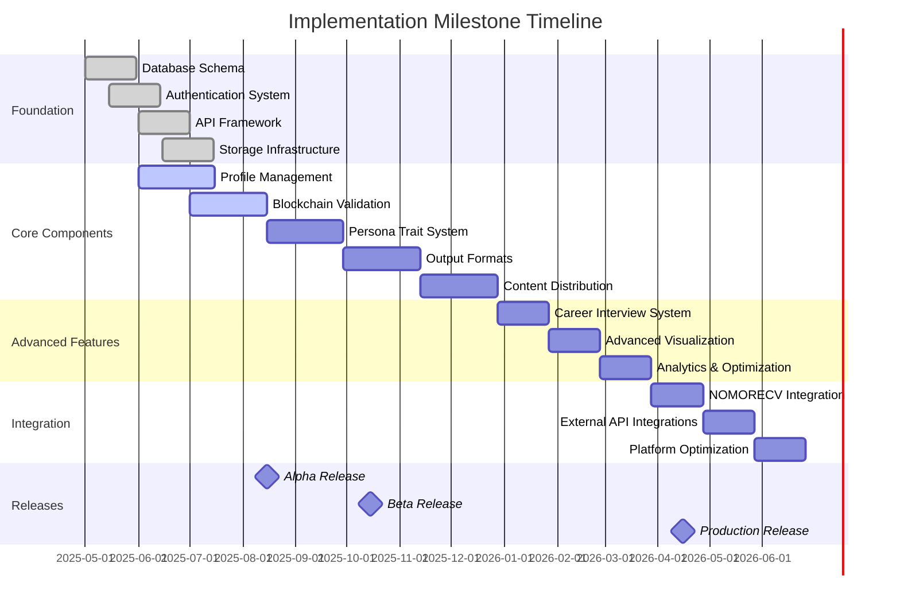

# Comprehensive Implementation Roadmap

## Overview

This document presents a comprehensive implementation roadmap for the innovative personal marketing platform that moves beyond traditional CVs to demonstrate professional value through evidence-based approaches. The roadmap integrates all components of the platform into a cohesive implementation plan with clear dependencies, milestones, and deliverables.

The platform consists of five core components:

1. **Platform Architecture**: The foundational structure that supports all platform capabilities
2. **Blockchain Validation Approach**: The system for verifying credentials and contributions while preserving privacy
3. **Persona Trait Input System**: The mechanism for capturing and representing professional traits and characteristics
4. **Output Formats and Interfaces**: The system for presenting professional value in context-specific formats
5. **Content Distribution Mechanism**: The framework for strategically distributing value demonstrations across channels

This roadmap provides a structured approach to implementing these components while allowing for parallel development where dependencies permit.

## Implementation Principles

1. **Dependency-Driven Development**: Prioritize components based on their dependencies to enable parallel development
2. **Iterative Implementation**: Build core functionality first, then enhance with advanced features
3. **Continuous Integration**: Regularly integrate components to ensure cohesive functionality
4. **User-Centered Validation**: Validate implementations with real users at key milestones
5. **Flexible Integration**: Support both standalone operation and integration with existing systems like NOMORECV
6. **Privacy by Design**: Implement privacy protections from the foundation up
7. **Show, Don't Tell Approach**: Prioritize features that demonstrate capabilities rather than just declaring them

## Dependency Map

The following diagram illustrates the dependencies between major components, helping to identify critical path elements and prioritize development:

```mermaid
graph TD
    classDef foundation fill:#f9d5e5, stroke:#333, stroke-width:2px
    classDef core fill:#d5f9e5, stroke:#333, stroke-width:2px
    classDef advanced fill:#d5e5f9, stroke:#333, stroke-width:1px
    classDef integration fill:#f9e5d5, stroke:#333, stroke-width:1px

    %% Foundation components
    DB[Database Schema] :::foundation
    Auth[Authentication System] :::foundation
    API[API Framework] :::foundation
    Storage[Storage Infrastructure] :::foundation
    
    %% Core components
    PM[Profile Management] :::core
    BV[Blockchain Validation] :::core
    PT[Persona Trait System] :::core
    OF[Output Formats] :::core
    CD[Content Distribution] :::core
    
    %% Advanced components
    CI[Career Interview System] :::advanced
    VE[Visualization Engine] :::advanced
    NF[Narrative Format Generator] :::advanced
    AE[Analytics Engine] :::advanced
    
    %% Integration components
    NCV[NOMORECV Integration] :::integration
    EXT[External API Connectors] :::integration
    
    %% Dependencies
    DB --> Auth
    DB --> PM
    DB --> BV
    DB --> PT
    
    Auth --> API
    PM --> API
    
    API --> OF
    API --> CD
    
    PM --> PT
    PM --> OF
    
    BV --> OF
    PT --> OF
    
    OF --> CD
    
    PT --> CI
    PM --> CI
    CI --> CD
    
    PM --> VE
    PT --> VE
    VE --> OF
    
    PM --> NF
    PT --> NF
    NF --> OF
    
    CD --> AE
    OF --> AE
    
    PM --> NCV
    OF --> NCV
    CD --> NCV
    
    CD --> EXT
    
    %% Legend
    L1[Foundation Components] :::foundation
    L2[Core Components] :::core
    L3[Advanced Components] :::advanced
    L4[Integration Components] :::integration
```

## Phased Implementation Plan

### Phase 1: Foundation (Months 1-3)

#### Month 1: Core Infrastructure

**Objectives:**
- Establish database schema and infrastructure
- Implement authentication system
- Create API framework
- Set up storage infrastructure

**Key Deliverables:**
1. **Database Schema Implementation**
   - User and profile data models
   - Credential and verification models
   - Trait and assessment models
   - Content and distribution models

2. **Authentication System**
   - User registration and login
   - OAuth integration for social login
   - Role-based access control
   - Session management

3. **API Framework**
   - RESTful API architecture
   - GraphQL schema (optional)
   - API documentation
   - Rate limiting and security

4. **Storage Infrastructure**
   - Document storage configuration
   - Media storage (images, videos, audio)
   - Content versioning system
   - Backup and recovery procedures

**Dependencies:**
- None (foundation components)

#### Month 2: Core Profile Management

**Objectives:**
- Implement basic profile management
- Create CV parsing and data extraction
- Develop profile data integration
- Build profile visualization basics

**Key Deliverables:**
1. **Profile Management System**
   - Profile creation and editing
   - Experience and education management
   - Skills and certifications tracking
   - Project and achievement documentation

2. **CV Parsing Engine**
   - Document upload and processing
   - Text extraction and section identification
   - Entity recognition (companies, roles, dates)
   - Data normalization and structuring

3. **Data Integration Framework**
   - Multiple source aggregation
   - Conflict resolution
   - Data enrichment
   - Change tracking

4. **Basic Profile Visualization**
   - Profile summary views
   - Timeline visualization
   - Skills matrix
   - Achievement highlights

**Dependencies:**
- Database Schema
- Authentication System
- API Framework
- Storage Infrastructure

#### Month 3: Blockchain Validation Core

**Objectives:**
- Implement blockchain validation foundation
- Create credential verification system
- Develop zero-knowledge proof mechanisms
- Build verification display components

**Key Deliverables:**
1. **Blockchain Integration**
   - Blockchain connector (Sui, Solana, or Cardano)
   - Smart contract development
   - Transaction management
   - Gas fee optimization

2. **Credential Verification System**
   - Credential issuance workflow
   - Verification request handling
   - Revocation mechanisms
   - Verification status tracking

3. **Zero-Knowledge Proof Implementation**
   - ZKP protocol selection and implementation
   - Proof generation and verification
   - Privacy-preserving verification
   - Selective disclosure mechanisms

4. **Verification Display Components**
   - Verification badges and indicators
   - Verification status visualization
   - Verification process explanation
   - QR code verification for offline checking

**Dependencies:**
- Database Schema
- API Framework
- Storage Infrastructure

### Phase 2: Core Components (Months 4-6)

#### Month 4: Persona Trait System

**Objectives:**
- Implement trait assessment mechanisms
- Create trait visualization components
- Develop trait-based recommendations
- Build trait evolution tracking

**Key Deliverables:**
1. **Trait Assessment Engine**
   - Direct assessment questionnaires
   - Indirect assessment through content analysis
   - External assessment integration
   - Comparative assessment benchmarking

2. **Trait Visualization Components**
   - Trait constellation visualization
   - Strength distribution charts
   - Trait comparison tools
   - Trait context adaptation

3. **Trait-Based Recommendation System**
   - Content emphasis recommendations
   - Skill development suggestions
   - Career path recommendations
   - Communication style guidance

4. **Trait Evolution Tracking**
   - Temporal trait analysis
   - Growth visualization
   - Development milestone tracking
   - Comparative historical analysis

**Dependencies:**
- Database Schema
- Profile Management System
- API Framework

#### Month 5: Output Formats and Interfaces

**Objectives:**
- Implement multi-perspective view generator
- Create interactive visualization engine
- Develop narrative format generator
- Build export and integration system

**Key Deliverables:**
1. **Multi-Perspective View Generator**
   - Role-specific views
   - Industry-contextualized presentations
   - Purpose-aligned narratives
   - Audience-adaptive content

2. **Interactive Visualization Engine**
   - Career trajectory visualization
   - Skills matrix visualization
   - Impact measurement dashboards
   - Value proposition illustrations

3. **Narrative Format Generator**
   - Story-driven professional narratives
   - Evidence-based capability demonstrations
   - Purpose-aligned professional statements
   - Adaptive personal brand articulation

4. **Export and Integration System**
   - Dynamic web profile generation
   - Interactive PDF creation
   - Presentation deck generation
   - API-based profile sharing

**Dependencies:**
- Profile Management System
- Blockchain Validation System
- Persona Trait System
- API Framework

#### Month 6: Content Distribution Mechanism

**Objectives:**
- Implement content manager
- Create distribution engine
- Develop channel adapters
- Build analytics engine foundation

**Key Deliverables:**
1. **Content Manager**
   - Content repository
   - Format conversion
   - Content versioning
   - Content tagging

2. **Distribution Engine**
   - Distribution rules engine
   - Scheduling system
   - Audience targeting
   - Distribution triggers

3. **Channel Adapters**
   - Professional network adapters
   - Job platform adapters
   - Personal website integration
   - Email campaign integration
   - Social media adapters
   - Direct sharing mechanisms

4. **Analytics Engine Foundation**
   - Engagement tracking
   - Channel performance analysis
   - Content performance metrics
   - Basic reporting dashboard

**Dependencies:**
- Profile Management System
- Output Formats and Interfaces
- API Framework
- Storage Infrastructure

### Phase 3: Advanced Features (Months 7-9)

#### Month 7: Career Coach Interview System

**Objectives:**
- Implement intelligent question generation
- Create video/audio interview capture
- Develop real-time guidance system
- Build interview content extraction

**Key Deliverables:**
1. **Intelligent Question Generation**
   - Context-aware question creation
   - Personalized question adaptation
   - Follow-up question generation
   - Industry-specific question libraries

2. **Video/Audio Interview System**
   - High-quality recording interface
   - Interview session management
   - Multi-format capture (video, audio, text)
   - Interview storage and organization

3. **Real-Time Guidance System**
   - Response analysis
   - Coaching suggestions
   - Delivery feedback
   - Content improvement recommendations

4. **Interview Content Extraction**
   - Key insight identification
   - Quote extraction
   - Topic segmentation
   - Content generation from interviews

**Dependencies:**
- Persona Trait System
- Profile Management System
- Content Distribution Mechanism
- Storage Infrastructure

#### Month 8: Advanced Visualization and Narrative

**Objectives:**
- Enhance visualization engine with advanced features
- Expand narrative generation capabilities
- Implement interactive storytelling components
- Create personalized content adaptation

**Key Deliverables:**
1. **Advanced Visualization Components**
   - Network relationship visualizations
   - Comparative analysis visualizations
   - Predictive trajectory visualizations
   - Interactive capability demonstrations

2. **Enhanced Narrative Generation**
   - Multi-format narrative creation
   - Adaptive storytelling
   - Evidence integration
   - Contextual narrative adaptation

3. **Interactive Storytelling Components**
   - Progressive disclosure interfaces
   - Choose-your-own-adventure professional stories
   - Interactive case studies
   - Guided capability demonstrations

4. **Personalized Content Adaptation**
   - Audience analysis
   - Content personalization engine
   - Dynamic content adjustment
   - A/B testing framework

**Dependencies:**
- Output Formats and Interfaces
- Persona Trait System
- Content Distribution Mechanism

#### Month 9: Analytics and Optimization

**Objectives:**
- Enhance analytics engine with advanced metrics
- Implement optimization recommendations
- Create performance dashboards
- Develop ROI calculation models

**Key Deliverables:**
1. **Advanced Analytics Metrics**
   - Engagement depth analysis
   - Audience response patterns
   - Conversion path tracking
   - Multi-channel attribution

2. **Optimization Recommendation Engine**
   - Content improvement suggestions
   - Distribution strategy optimization
   - Channel performance recommendations
   - Audience targeting refinement

3. **Performance Dashboards**
   - Executive summary dashboard
   - Detailed performance analysis
   - Comparative benchmarking
   - Trend analysis and forecasting

4. **ROI Calculation Models**
   - Value attribution models
   - Opportunity cost analysis
   - Time-to-value metrics
   - Investment optimization recommendations

**Dependencies:**
- Content Distribution Mechanism
- Output Formats and Interfaces
- Career Coach Interview System

### Phase 4: Integration and Scaling (Months 10-12)

#### Month 10: NOMORECV Integration

**Objectives:**
- Implement NOMORECV data integration
- Create synchronization mechanisms
- Develop complementary workflows
- Build unified user experience

**Key Deliverables:**
1. **Data Integration Framework**
   - Profile data synchronization
   - CV parsing integration
   - Template sharing
   - Credential verification integration

2. **Synchronization Mechanisms**
   - Real-time updates
   - Conflict resolution
   - Change tracking
   - Selective synchronization

3. **Complementary Workflows**
   - NOMORECV as data source
   - NOMORECV as distribution channel
   - Standalone with import/export
   - Hybrid operation modes

4. **Unified User Experience**
   - Consistent interface design
   - Seamless transitions
   - Integrated authentication
   - Unified notifications

**Dependencies:**
- Profile Management System
- Output Formats and Interfaces
- Content Distribution Mechanism

#### Month 11: External API Integrations

**Objectives:**
- Implement professional network integrations
- Create job platform connectors
- Develop social media integrations
- Build email marketing platform connections

**Key Deliverables:**
1. **Professional Network Integrations**
   - LinkedIn API integration
   - Indeed API integration
   - Glassdoor API integration
   - Custom network connectors

2. **Job Platform Connectors**
   - Monster integration
   - CareerBuilder integration
   - ZipRecruiter integration
   - Custom platform connectors

3. **Social Media Integrations**
   - Twitter API integration
   - Facebook API integration
   - Instagram API integration
   - Custom social connectors

4. **Email Marketing Integrations**
   - Mailchimp integration
   - SendGrid integration
   - Campaign Monitor integration
   - Custom email platform connectors

**Dependencies:**
- Content Distribution Mechanism
- API Framework
- Authentication System

#### Month 12: Platform Optimization and Scaling

**Objectives:**
- Optimize performance across all components
- Implement scalability enhancements
- Create enterprise features
- Develop marketplace capabilities

**Key Deliverables:**
1. **Performance Optimization**
   - Database query optimization
   - API response time improvements
   - Front-end performance enhancements
   - Media delivery optimization

2. **Scalability Enhancements**
   - Horizontal scaling architecture
   - Load balancing implementation
   - Caching strategy
   - Resource utilization optimization

3. **Enterprise Features**
   - Team-based management
   - Organizational templates
   - Role-based access control
   - Enterprise analytics

4. **Marketplace Capabilities**
   - Template marketplace
   - Verification service marketplace
   - Expert coaching marketplace
   - Integration service marketplace

**Dependencies:**
- All previous components

## Milestone Timeline

The following timeline illustrates key milestones across the implementation phases:



## Development Team Structure

The implementation will be organized around cross-functional teams aligned with the major components:

### Core Platform Team
- **Responsibilities**: Database schema, authentication, API framework, storage infrastructure
- **Composition**: Backend developers, database specialists, DevOps engineers
- **Key Skills**: Database design, API development, authentication systems, cloud infrastructure

### Profile & Trait Team
- **Responsibilities**: Profile management, persona trait system, CV parsing
- **Composition**: Full-stack developers, data scientists, UX designers
- **Key Skills**: Data modeling, natural language processing, visualization, user experience design

### Blockchain & Verification Team
- **Responsibilities**: Blockchain integration, credential verification, zero-knowledge proofs
- **Composition**: Blockchain developers, cryptography specialists, security engineers
- **Key Skills**: Smart contract development, cryptographic protocols, security implementation

### Output & Distribution Team
- **Responsibilities**: Output formats, content distribution, channel adapters
- **Composition**: Full-stack developers, front-end specialists, integration engineers
- **Key Skills**: Front-end frameworks, content management, API integration, responsive design

### Interview & Analytics Team
- **Responsibilities**: Career coach interview system, analytics engine
- **Composition**: AI/ML engineers, video processing specialists, data analysts
- **Key Skills**: Natural language processing, video/audio processing, data analysis, visualization

### Integration & Scaling Team
- **Responsibilities**: NOMORECV integration, external APIs, optimization
- **Composition**: Integration specialists, performance engineers, DevOps
- **Key Skills**: API integration, performance optimization, scalability, monitoring

## Risk Management

### Technical Risks

| Risk | Impact | Probability | Mitigation Strategy |
|------|--------|------------|---------------------|
| Blockchain integration complexity | High | Medium | Start with simplified verification model, then enhance; engage blockchain specialists early |
| Video interview system performance | Medium | High | Implement progressive quality enhancement; use cloud processing for intensive tasks |
| Integration with external APIs | Medium | Medium | Build flexible adapter architecture; implement graceful degradation |
| Data privacy compliance | High | Medium | Implement privacy by design; regular security audits; compliance reviews |
| Scalability challenges | Medium | Low | Design for horizontal scaling; implement load testing early |

### Project Risks

| Risk | Impact | Probability | Mitigation Strategy |
|------|--------|------------|---------------------|
| Dependency bottlenecks | High | Medium | Implement critical path monitoring; maintain buffer in schedule for critical components |
| Scope creep | Medium | High | Rigorous change management process; clear prioritization framework |
| Resource constraints | Medium | Medium | Cross-train team members; identify external resources for specialized needs |
| Integration with NOMORECV challenges | Medium | Medium | Early proof-of-concept integration; regular synchronization with NOMORECV team |
| User adoption barriers | High | Low | Early user testing; progressive feature rollout; comprehensive onboarding |

## Success Metrics

The implementation will be evaluated against the following key metrics:

### Technical Metrics
- **Performance**: Page load times < 2 seconds; API response times < 200ms
- **Scalability**: Support for 100,000+ users with linear resource scaling
- **Reliability**: 99.9% uptime; < 0.1% error rate
- **Security**: Zero critical vulnerabilities; 100% compliance with data protection regulations

### User Experience Metrics
- **Usability**: Task completion rate > 90%; user satisfaction score > 4.5/5
- **Engagement**: Average session duration > 10 minutes; return rate > 60%
- **Adoption**: Feature utilization across 80% of available features
- **Retention**: 30-day retention rate > 70%; 90-day retention rate > 50%

### Business Metrics
- **User Growth**: 20% month-over-month growth in active users
- **Content Creation**: Average 5+ content pieces per user
- **Distribution Effectiveness**: 30% engagement rate on distributed content
- **Conversion Impact**: 25% improvement in professional opportunity conversion

## Integration with Existing NOMORECV Architecture

The implementation will leverage relevant components from the existing NOMORECV architecture while introducing new capabilities:

### Components to Leverage
- **CV Parser**: Integrate with existing parser for document processing
- **Profile Service**: Use as a data source for professional information
- **Template Service**: Leverage for content formatting and presentation
- **Data Aggregator**: Utilize for multi-source data integration

### New Components to Introduce
- **Blockchain Validation System**: Add credential verification capabilities
- **Persona Trait System**: Introduce trait assessment and visualization
- **Career Coach Interview System**: Add interactive interview capabilities
- **Content Distribution Mechanism**: Implement strategic content distribution

### Integration Approaches

1. **API-Based Integration**:
   - Implement API connectors between systems
   - Use webhook notifications for real-time updates
   - Maintain separate databases with synchronization

2. **Shared Database Approach**:
   - Extend existing database schema
   - Implement new tables for new components
   - Maintain data integrity across components

3. **Microservices Architecture**:
   - Deploy new components as independent microservices
   - Implement service discovery and orchestration
   - Use message queues for asynchronous communication

## Conclusion

This comprehensive implementation roadmap provides a structured approach to building an innovative personal marketing platform that moves beyond traditional CVs. By following a dependency-driven development approach, the implementation can proceed efficiently with parallel development where possible while ensuring that critical dependencies are addressed in the proper sequence.

The phased implementation plan allows for incremental delivery of value, with each phase building upon the foundation established in previous phases. The milestone timeline provides clear targets for progress tracking, while the risk management strategies help anticipate and mitigate potential challenges.

The integration with the existing NOMORECV architecture leverages valuable components while introducing new capabilities that enhance the overall platform. This approach maximizes the value of existing investments while enabling the innovative features required to transform professional marketing.

By following this roadmap, the implementation team can deliver a platform that enables professionals to effectively demonstrate their value through evidence-based approaches rather than traditional resume formats, creating a more authentic and impactful professional marketing experience.
