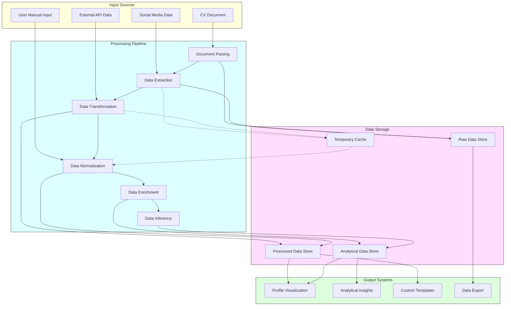
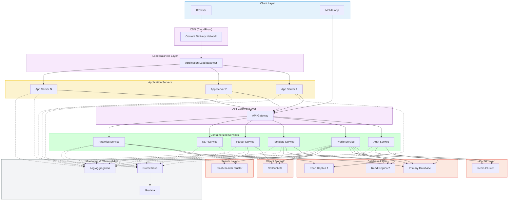
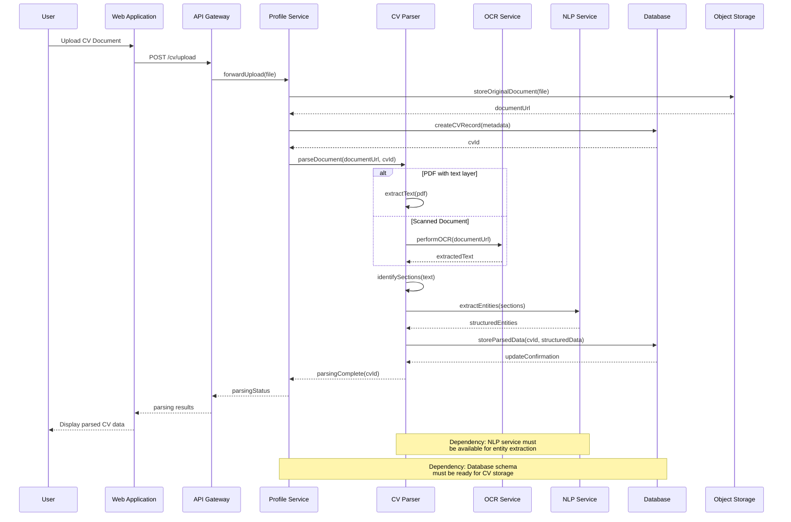
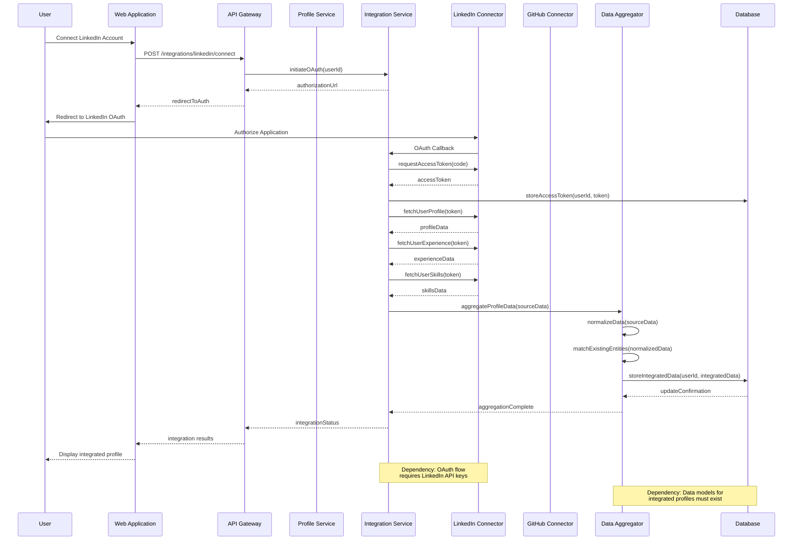

# Help Them Discover You: Dependency-Driven System Architecture

## System Architecture Overview

This document provides a comprehensive visualization of the platform architecture with an emphasis on component dependencies and data flows. The architecture is designed to enable parallel development while maintaining clear dependencies between components.

## Core System Architecture

```mermaid
flowchart TB
    subgraph Client["Client Layer"]
        WebApp["Web Application\n(React/TypeScript)"]
        MobileApp["Mobile Application\n(React Native)"]
        ThirdParty["Third-Party Apps\n(API Consumers)"]
    end

    subgraph API["API Gateway Layer"]
        GraphQL["GraphQL API"]
        REST["REST API"]
        WebSocket["WebSocket API"]
    end

    subgraph Services["Service Layer"]
        Auth["Authentication\nService"]
        Profile["Profile\nService"]
        Analytics["Analytics\nService"]
        Sharing["Sharing\nService"]
        Template["Template\nService"]
        Recommend["Recommendation\nService"]
    end

    subgraph DataProc["Data Processing Layer"]
        CVParser["CV Parser"]
        OCR["OCR Service"]
        DataAgg["Data\nAggregator"]
        NLP["NLP Service"]
        Inference["Inference\nEngine"]
        MLModel["ML Model\nService"]
    end

    subgraph Storage["Storage Layer"]
        RDBMS["Relational DB\n(PostgreSQL)"]
        DocDB["Document DB\n(MongoDB)"]
        ObjStore["Object Storage\n(S3)"]
        Cache["Cache\n(Redis)"]
        Search["Search Index\n(Elasticsearch)"]
        TimeSeries["Time Series DB\n(InfluxDB)"]
    end

    subgraph Integration["Integration Layer"]
        SocialMedia["Social Media\nConnectors"]
        ATS["ATS\nConnectors"]
        HRMS["HRMS\nConnectors"]
    end

    %% Client to API connections
    WebApp --> GraphQL
    WebApp --> REST
    WebApp --> WebSocket
    MobileApp --> GraphQL
    MobileApp --> REST
    ThirdParty --> GraphQL
    ThirdParty --> REST

    %% API to Services connections
    GraphQL --> Auth
    GraphQL --> Profile
    GraphQL --> Analytics
    GraphQL --> Sharing
    GraphQL --> Template
    GraphQL --> Recommend

    REST --> Auth
    REST --> Profile
    REST --> Sharing
    
    WebSocket --> Sharing
    WebSocket --> Recommend

    %% Services to Data Processing connections
    Profile --> CVParser
    Profile --> DataAgg
    Analytics --> NLP
    Analytics --> Inference
    Analytics --> MLModel
    Recommend --> Inference
    Recommend --> MLModel

    %% Data Processing interconnections
    CVParser --> OCR
    CVParser --> NLP
    DataAgg --> NLP
    Inference --> MLModel

    %% Services to Storage connections
    Auth --> RDBMS
    Auth --> Cache
    Profile --> RDBMS
    Profile --> DocDB
    Profile --> ObjStore
    Profile --> Search
    Analytics --> DocDB
    Analytics --> TimeSeries
    Sharing --> RDBMS
    Sharing --> Cache
    Template --> DocDB
    Template --> ObjStore
    Recommend --> RDBMS
    Recommend --> DocDB

    %% Integration connections
    SocialMedia --> DataAgg
    ATS --> DataAgg
    HRMS --> DataAgg
    DataAgg --> DocDB
    
    %% Define dependency classifications with styles
    classDef criticalPath fill:#f9a,stroke:#333,stroke-width:2px
    classDef highDependency fill:#adf,stroke:#333,stroke-width:1px
    classDef mediumDependency fill:#fea,stroke:#333,stroke-width:1px
    classDef lowDependency fill:#afa,stroke:#333,stroke-width:1px
    
    %% Assign classes to nodes
    class Auth,Profile,CVParser,RDBMS,DocDB criticalPath
    class GraphQL,REST,DataAgg,Template,Sharing highDependency
    class Analytics,Recommend,NLP,Inference mediumDependency
    class WebSocket,OCR,MLModel,ObjStore,Cache,Search,TimeSeries,SocialMedia,ATS,HRMS lowDependency
```



## Component Dependency Matrix

The following matrix illustrates the dependencies between major system components, helping to identify critical path elements and prioritize development.

```mermaid
graph TD
    classDef primary fill:#f9a,stroke:#333,stroke-width:2px
    classDef secondary fill:#adf,stroke:#333,stroke-width:1px
    classDef tertiary fill:#afa,stroke:#333,stroke-width:1px

    %% Primary components (critical path)
    A[Authentication Service] :::primary
    P[Profile Service] :::primary
    C[CV Parser] :::primary
    D[Database Core Schema] :::primary
    
    %% Secondary components
    API[API Layer] :::secondary
    T[Template Service] :::secondary
    S[Sharing Service] :::secondary
    DA[Data Aggregator] :::secondary
    U[UI Component Library] :::secondary
    
    %% Tertiary components
    AN[Analytics Service] :::tertiary
    R[Recommendation Service] :::tertiary
    N[NLP Service] :::tertiary
    ML[ML Model Service] :::tertiary
    I[Integration Connectors] :::tertiary
    
    %% Dependencies between components
    D --> A
    D --> P
    P --> C
    A --> API
    P --> API
    P --> T
    P --> S
    C --> DA
    API --> U
    
    DA --> N
    DA --> AN
    AN --> ML
    AN --> R
    N --> ML
    P --> I
    
    %% Legend
    L1[Critical Path Components] :::primary
    L2[High Dependency Components] :::secondary
    L3[Lower Dependency Components] :::tertiary
```

## Data Flow Architecture



## Deployment Architecture



## Sequence Diagrams for Key Workflows

### CV Upload and Processing Sequence



### Multi-Source Data Integration Sequence



This document serves as a blueprint for implementing a dependency-driven development approach, highlighting the relationships between components, data flows, and deployment considerations. The diagrams provide a clear visual representation of the system architecture, helping development teams understand dependencies and coordinate their efforts effectively.